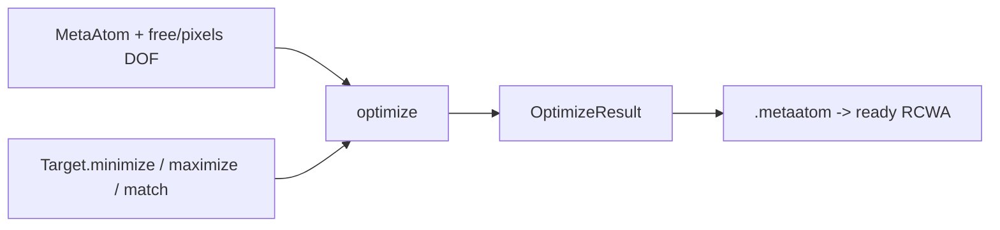

# Inverse Design

```python
from ikarus.inverse import MetaAtom, free, pixels, Target, optimize
```

!!! note "Optional dependency"
    The inverse module needs **pymoo**: `pip install "ikarus-rcwa[inverse]"`.

Gradient-free inverse design in three steps: define a parameterized **metaatom**,
declare one or more **targets**, then **optimize**. The optimizer treats the binary
pixels with bit-flip mutation and continuous parameters with SBX/PM, and runs a
mixed-variable genetic algorithm (single objective) or NSGA-III (multi-objective).



## Degrees of freedom

#### `free(low, high) -> Free`

Mark a continuous parameter (a height or period) as a free DOF bounded to
`[low, high]` (SI units).

#### `pixels(nx, ny, symmetry=None) -> Pixels`

Mark the patterned-layer topology as a free binary pixel map. `symmetry` reduces
the number of independent pixels and enforces the corresponding structural
symmetry:

| `symmetry` | Meaning | Constraint |
|---|---|---|
| `None` | all `nx*ny` pixels free | — |
| `"mirror_x"`, `"mirror_y"`, `"mirror_xy"` | reflection symmetry | — |
| `"c2"` | 180° rotation | — |
| `"c4"` | 90° rotation | square grid |
| `"c4v"` | 90° rotation + mirrors | square grid |

`Pixels.n_free` gives the number of independent bits (e.g. an 8×8 `c4v` grid → 10
bits). `Pixels.expand(bits)` reconstructs the full `(nx, ny)` 0/1 grid.

## `MetaAtom`

```python
MetaAtom(period, cover, substrate, polarization="linear", pol_angle=0.0)
```

A parameterized 3-region metaatom: **cover / patterned layer / substrate**. The
`period` and the pattern `height` may be fixed floats or `free(...)` ranges; the
topology may be a fixed integer array or a `pixels(...)` map.

#### `add_pattern(topology, materials, height) -> MetaAtom`

Add the single patterned layer. `materials` indexes as `0 -> materials[0]`, etc.

#### `variables() -> dict`

Return `{name: ('real', (lo, hi)) | ('binary',)}` describing every free DOF
(`period`, `height`, `px0`, `px1`, …) for the optimizer.

#### `n_dof -> int`

The number of free degrees of freedom.

#### `build(params, n_orders) -> RCWA`

Construct the concrete [`RCWA`](rcwa.md) for a parameter assignment (no source set).

```python
atom = MetaAtom(period=180e-9, cover="Air", substrate="SiO2")
atom.add_pattern(topology=pixels(8, 8, symmetry="c4v"),
                 materials=["Air", "Si3N4"],
                 height=free(40e-9, 200e-9))
print(atom.variables())   # {'height': ('real', (4e-08, 2e-07)), 'px0': ('binary',), ...}
```

## `Target`

A single figure of merit (lower is better internally). Build with a classmethod:

```python
Target.maximize(metric, at=None, band=None, order=(0, 0), **kw)
Target.minimize(metric, at=None, band=None, order=(0, 0), **kw)
Target.match(metric, value, at=None, band=None, order=(0, 0), **kw)
```

**Metrics**

| Metric | Meaning |
|---|---|
| `"R"`, `"T"` | Diffraction efficiency into `order` (default specular `(0,0)`; `order=None` → total). |
| `"r_co"`, `"t_co"` | Complex zero-order coefficient (co-pol). |
| `"r_cross"`, `"t_cross"` | Cross-pol coefficient (0 for linear polarization). |
| `"r_phase"`, `"t_phase"` | Phase (rad), matched modulo \(2\pi\). |

**Wavelength specification** (one of):

| Argument | Meaning |
|---|---|
| `at=1550e-9` | a single wavelength |
| `at=[1064e-9, 1550e-9]` | a discrete set |
| `band=(lo, hi)` or `band=(lo, hi, n)` | a sampled continuous range (`n` defaults to 8) |

**Keyword options**

| Keyword | Default | Meaning |
|---|---|---|
| `order` | `(0, 0)` | diffraction order; `None`/`"total"` for the sum |
| `weight` | `1.0` | scales this target's contribution |
| `worst_case` | `False` | aggregate multiple wavelengths by the worst point instead of the mean |
| `name` | auto | label used in `report()` |

```python
# AR coating: minimize reflection across a band, worst-case.
ar = Target.minimize("R", band=(300e-9, 600e-9, 6), worst_case=True)

# Beam steering: push power into the +1 reflected order at 1550 nm.
steer = Target.maximize("R", order=(1, 0), at=1550e-9)

# Phase target for a metalens pixel.
phase = Target.match("t_phase", value=1.57, at=1550e-9)
```

## `optimize`

```python
optimize(atom, targets, n_orders=8, algorithm="auto",
         pop=100, n_gen=60, seed=0, verbose=True) -> OptimizeResult
```

| Argument | Default | Description |
|---|---|---|
| `atom` | — | a `MetaAtom`. |
| `targets` | — | a `Target` or list. Two or more → multi-objective (Pareto). |
| `n_orders` | `8` | harmonic truncation for every forward solve. |
| `algorithm` | `"auto"` | `"auto"` (GA if one objective, NSGA-III if several), or `"ga"`, `"nsga2"`, `"nsga3"`. |
| `pop`, `n_gen` | `100`, `60` | population size and generations. |
| `seed` | `0` | RNG seed (reproducible). |
| `verbose` | `True` | print per-generation progress. |

### `OptimizeResult`

| Member | Description |
|---|---|
| `params` | Best parameter dict (first Pareto point for multi-objective). |
| `metaatom` | The optimized structure as a ready-to-simulate `RCWA`. |
| `report() -> str` | Human-readable summary (objective + non-pixel parameters, or the Pareto front). |
| `X`, `F` | Raw best parameters and objective value(s). |
| `multi` | `True` for multi-objective runs. |

## Complete example — broadband AR coating

```python
import numpy as np
from ikarus.inverse import MetaAtom, free, pixels, Target, optimize

atom = MetaAtom(period=180e-9, cover="Air", substrate="SiO2")
atom.add_pattern(topology=pixels(8, 8, symmetry="c4v"),
                 materials=["Air", "Si3N4"], height=free(40e-9, 200e-9))

target = Target.minimize("R", band=(300e-9, 600e-9, 6), worst_case=True)
best = optimize(atom, target, n_orders=6, pop=16, n_gen=10, seed=0)
print(best.report())

coating = best.metaatom                       # a ready RCWA
coating.set_source(wavelength=450e-9, theta=0, polarization="linear")
print("R @ 450 nm:", coating.simulate()[2].R_total)
```

### Best practices

- **Pin BLAS to one thread** for these tight loops (see
  [Performance](../performance.md)) — the per-solve matrices are small and
  multithreading oversubscribes cores.
- Keep the metaatom **subwavelength** when you want effective-medium behaviour
  (no spurious diffraction orders during optimization).
- Use `worst_case=True` for broadband robustness; use a discrete `at=[...]` list
  when you only care about specific lines.
- Start with a small `pop`/`n_gen` to gauge runtime, then scale up. Use the symmetry
  argument of `pixels` to shrink the search space dramatically (an 8×8 `c4v` grid
  is 10 bits, not 64).
- For multiple competing goals (e.g. high `T` *and* a phase target), pass a list of
  targets and read the Pareto front from `report()`.
