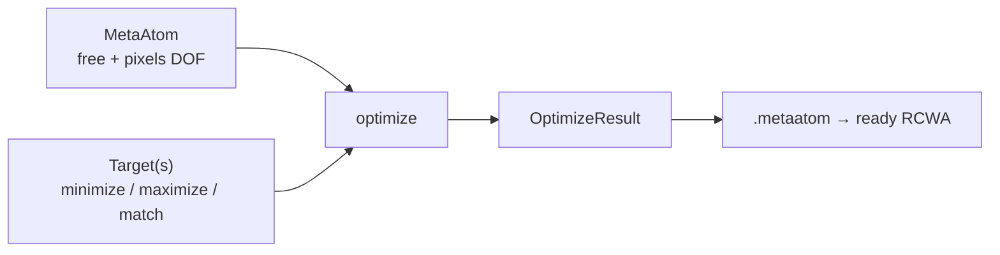

# Inverse Design

```python
from ikarus.inverse import MetaAtom, free, pixels, Target, optimize
```

*Declare what you want; let evolution do the drafting.* Three steps: define a
parameterized **metaatom**, state one or more **targets**, call **optimize**.
Binary pixels evolve by bit-flip, continuous parameters by SBX/PM, under a
mixed-variable GA (one objective) or NSGA-III (several).

!!! note "Optional dependency"
    Needs **pymoo**: `pip install "ikarus-rcwa[inverse]"`.



## Degrees of freedom

#### `free(low, high) -> Free`

Mark a continuous parameter (height or period) as a free DOF bounded to
`[low, high]` (SI units).

#### `pixels(nx, ny, symmetry=None) -> Pixels`

Mark the patterned-layer topology as a free binary pixel map. `symmetry`
shrinks the search space *and* enforces the physical symmetry:

| `symmetry` | Meaning | Constraint |
|---|---|---|
| `None` | all `nx*ny` pixels free | — |
| `"mirror_x"`, `"mirror_y"`, `"mirror_xy"` | reflection symmetry | — |
| `"c2"` | 180° rotation | — |
| `"c4"` | 90° rotation | square grid |
| `"c4v"` | 90° rotation + mirrors | square grid |

`Pixels.n_free` is the independent bit count (an 8×8 `c4v` grid → just 10
bits); `Pixels.expand(bits)` rebuilds the full `(nx, ny)` 0/1 grid.

#### Parametric shapes

A [`Shape`](shapes.md#parametric-shapes) (`Cross`, `SplitRing`, `Ellipse`, …)
used as a topology turns each of its `free(...)` parameters into a real DOF named
`shape__<param>` (e.g. `shape__arm_length`, `shape__angle`). This optimizes a
*physically interpretable* meta-atom — arm widths, radii, rotation — instead of a
pixel grid, over far fewer variables. See
[Lesson 7](../tutorials/inverse-design.md).

```python
from ikarus.shapes import Cross
from ikarus.inverse import free

topology = Cross(arm_length=free(0.3, 0.95), arm_width=free(0.1, 0.45),
                 angle=free(0, 90))   # 3 free DOF + a clean, manufacturable shape
```

## `MetaAtom`

```python
MetaAtom(period, cover, substrate, polarization="linear", pol_angle=0.0)
```

A parameterized 3-region metaatom: **cover / patterned layer / substrate**.
`period` and the pattern `height` may be fixed floats or `free(...)` ranges;
the topology may be a fixed array, a `pixels(...)` map, or a parametric
[`Shape`](shapes.md#parametric-shapes) with free parameters.

#### `add_pattern(topology, materials, height) -> MetaAtom`

Add the single patterned layer (`0 -> materials[0]`, etc.).

#### `variables() -> dict`

`{name: ('real', (lo, hi)) | ('binary',)}` for every free DOF (`period`,
`height`, `px0`, `px1`, …) — also your search space when bringing your own
optimizer.

#### `n_dof -> int`

Number of free degrees of freedom.

#### `build(params, n_orders) -> RCWA`

The concrete [`RCWA`](rcwa.md) for one parameter assignment (no source set).

```python
atom = MetaAtom(period=180e-9, cover="Air", substrate="SiO2")
atom.add_pattern(topology=pixels(8, 8, symmetry="c4v"),
                 materials=["Air", "Si3N4"],
                 height=free(40e-9, 200e-9))
print(atom.variables())
# {'height': ('real', (4e-08, 2e-07)), 'px0': ('binary',), ...}
```

## `Target`

One figure of merit. Build with a classmethod:

```python
Target.maximize(metric, at=None, band=None, order=(0, 0), **kw)
Target.minimize(metric, at=None, band=None, order=(0, 0), **kw)
Target.match(metric, value, at=None, band=None, order=(0, 0), **kw)
```

**Metrics**

| Metric | Meaning |
|---|---|
| `"R"`, `"T"` | Diffraction efficiency into `order` (default specular `(0,0)`; `order=None` → total). |
| `"r_co"`, `"t_co"` | Complex zero-order coefficient (co-pol). |
| `"r_cross"`, `"t_cross"` | Cross-pol coefficient (0 for linear polarization). |
| `"r_phase"`, `"t_phase"` | Phase (rad), matched modulo \(2\pi\). |

**Wavelengths** (pick one)

| Argument | Meaning |
|---|---|
| `at=1550e-9` | one wavelength |
| `at=[1064e-9, 1550e-9]` | a discrete set |
| `band=(lo, hi)` or `band=(lo, hi, n)` | a sampled range (`n` defaults to 8) |

**Options**

| Keyword | Default | Meaning |
|---|---|---|
| `order` | `(0, 0)` | diffraction order; `None`/`"total"` for the sum |
| `weight` | `1.0` | scales this target's contribution |
| `worst_case` | `False` | aggregate wavelengths by the worst point, not the mean |
| `name` | auto | label used in `report()` |

```python
# AR coating: minimize reflection across a band, robustly.
ar = Target.minimize("R", band=(300e-9, 600e-9, 6), worst_case=True)

# Beam steering: shove power into the +1 reflected order.
steer = Target.maximize("R", order=(1, 0), at=1550e-9)

# A metalens pixel: pin the transmission phase.
phase = Target.match("t_phase", value=1.57, at=1550e-9)
```

## `optimize`

```python
optimize(atom, targets, n_orders=8, algorithm="auto",
         pop=100, n_gen=60, seed=0, verbose=True) -> OptimizeResult
```

| Argument | Default | Description |
|---|---|---|
| `atom` | — | a `MetaAtom`. |
| `targets` | — | a `Target` or list (≥ 2 → multi-objective Pareto). |
| `n_orders` | `8` | harmonic truncation for every forward solve. |
| `algorithm` | `"auto"` | GA if one objective, NSGA-III if several; or `"ga"`, `"nsga2"`, `"nsga3"`. |
| `pop`, `n_gen` | `100`, `60` | population size and generations. |
| `seed` | `0` | RNG seed — runs are reproducible. |
| `verbose` | `True` | print the per-generation pymoo table. |
| `progress` | `False` | show one [progress bar](sweeps.md#optimization-progress) over the generations (sets `verbose=False`). |

### `OptimizeResult`

| Member | Description |
|---|---|
| `params` | Best parameter dict (first Pareto point if multi-objective). |
| `metaatom` | The optimized structure as a ready-to-simulate `RCWA`. |
| `report() -> str` | Human-readable summary (objective + parameters, or the Pareto front). |
| `X`, `F` | Raw best parameters and objective value(s). |
| `multi` | `True` for multi-objective runs. |

## Complete example — broadband AR coating

```python
import numpy as np
from ikarus.inverse import MetaAtom, free, pixels, Target, optimize

atom = MetaAtom(period=180e-9, cover="Air", substrate="SiO2")
atom.add_pattern(topology=pixels(8, 8, symmetry="c4v"),
                 materials=["Air", "Si3N4"], height=free(40e-9, 200e-9))

target = Target.minimize("R", band=(300e-9, 600e-9, 6), worst_case=True)
best = optimize(atom, target, n_orders=6, pop=16, n_gen=10, seed=0)
print(best.report())

coating = best.metaatom                       # a ready RCWA
coating.set_source(wavelength=450e-9, theta=0, polarization="linear")
print("R @ 450 nm:", coating.simulate()[2].R_total)
```

### Best practices

- **Pin BLAS to one thread** for these tight loops
  ([why it's worth ~10×](../performance.md#blas-threading)).
- Keep the metaatom **subwavelength** for effective-medium behavior — no
  parasitic diffraction lanes during evolution.
- `worst_case=True` for broadband robustness; a discrete `at=[...]` list when
  only specific lines matter.
- Exploit symmetry: 8×8 `c4v` is a 10-bit search, 8×8 free is 64 bits — a
  difference of *eighteen orders of magnitude* in search-space size.
- Start with small `pop`/`n_gen` to gauge runtime, then scale.
- Competing goals (high `T` *and* a phase)? Pass a list of targets and read
  the Pareto front from `report()`.
