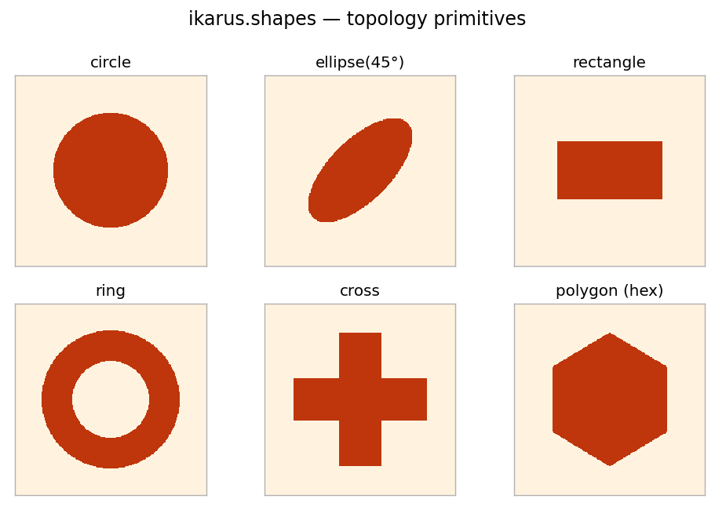

# Shapes

```python
from ikarus import shapes
```

Geometric primitives that generate **integer topology maps** for patterned
layers — your meta-atom sketchpad. Each returns a `numpy.ndarray` of shape
`grid_shape`; filled pixels take `value` (default `1`), the rest take
`background` (default `0`). Pass the result straight to
[`RCWA.add_layer`](rcwa.md#add_layer).

!!! info "Fractional coordinates"
    All centers, radii and sizes live in **fractional unit-cell units**
    \([0, 1)\), so a shape is independent of pixel resolution. Pixel
    \((i, j)\) is sampled at its center \(((i+0.5)/N_x,\ (j+0.5)/N_y)\).

## Primitives

#### `circle(center=(0.5, 0.5), radius=0.25, grid_shape=(32, 32), value=1, background=0)`

A filled circle (special case of `ellipse`).

#### `ellipse(center=(0.5, 0.5), radii=(0.25, 0.15), grid_shape=(32, 32), angle=0.0, value=1, background=0)`

A filled, optionally rotated ellipse. `radii = (rx, ry)`, `angle` in degrees.

#### `rectangle(center=(0.5, 0.5), size=(0.5, 0.5), grid_shape=(32, 32), value=1, background=0)`

An axis-aligned filled rectangle of fractional `size = (width, height)`.

#### `ring(center=(0.5, 0.5), inner_radius=0.15, outer_radius=0.25, grid_shape=(32, 32), value=1, background=0)`

An annulus between two radii.

#### `cross(center=(0.5, 0.5), arm_length=0.4, arm_width=0.12, grid_shape=(32, 32), value=1, background=0)`

A plus/cross (two overlapping rectangles).

#### `polygon(vertices, grid_shape=(32, 32), value=1, background=0)`

A filled simple polygon from fractional `(x, y)` vertices (even–odd
ray-casting rule).

#### `combine(*maps, mode="overlay")`

Merge several topology maps. `"overlay"` (default): later non-zero pixels win.
`"max"`: elementwise maximum index — handy for **three or more** materials.

#### `rotate(topology, angle, order=0)`

Rotate an integer topology map by `angle` degrees (CCW) about its center, with
**periodic wrapping** so the result still tiles the unit cell. `order=0`
(nearest-neighbour) keeps it integer-valued; raise it for smoother edges on
coarse grids. For the parametric classes below, prefer their native `angle`
argument — it rotates the geometry analytically, with no resampling.

<figure markdown="span">
  { width="600" }
  <figcaption>The built-in <code>ikarus.shapes</code> primitives, each rendered on a unit cell.</figcaption>
</figure>

## Parametric shapes { #parametric-shapes }

Where the functions above return a *fixed* array, a **`Shape`** class carries
*named parameters* and a rotation `angle` — and any parameter may be a
[`free(lo, hi)`](inverse.md#degrees-of-freedom) range. That makes a `Shape`
usable two ways: as an ordinary topology, or as an inverse-design degree of
freedom whose parameters the optimizer chooses (see
[Lesson 7](../tutorials/inverse-design.md)).

```python
from ikarus.shapes import Cross

# as a plain topology:
topo = Cross(arm_length=0.7, arm_width=0.2, angle=30).to_grid((128, 128))

# or hand it straight to add_layer (it rasterizes at the solver resolution):
rcwa.add_layer(200e-9, Cross(arm_length=0.7, arm_width=0.2, angle=30), ["Air", "Si"])
```

### Shipped classes

| Class | Parameters (besides `center`, `angle`) |
|---|---|
| `Circle` | `radius` |
| `Ellipse` | `rx`, `ry` |
| `Rectangle` | `width`, `height` |
| `Ring` | `inner_radius`, `outer_radius` |
| `Cross` | `arm_length`, `arm_width` |
| `SplitRing` | `inner_radius`, `outer_radius`, `gap_angle` (the gap opens along the local +x axis, so `angle` rotates it) |

Every class also accepts `center=(0.5, 0.5)`, `angle=0.0`,
`grid_shape=(128, 128)`, `value=1`, `background=0`.

### `Shape` interface

| Member | Description |
|---|---|
| `to_grid(grid_shape=None, overrides=None) -> ndarray` | Rasterize to an integer array. Free parameters must be supplied via `overrides` (`{name: value}`). |
| `img` *(property)* | The rendered grid — a Topology-Species-compatible attribute, so external objects exposing `.img` also work in `add_layer`. |
| `free_parameters() -> dict` | `{name: (low, high)}` for every parameter left free (including `angle`). |
| `resolved(overrides=None) -> Shape` | A concrete copy with all free parameters replaced. |

### Defining your own

Subclass `Shape`: declare parameters in `_PARAMS` (a tuple of `(name, default)`)
and implement `_mask(self, u, v, p)`, returning a boolean mask. `u, v` are
coordinates already centered and rotated, and `p` is the resolved parameter dict.
Rotation, free-parameter handling and the inverse-design plumbing come for free.

```python
import numpy as np
from ikarus.shapes import Shape

class Diamond(Shape):
    _PARAMS = (("half_width", 0.3),)
    def _mask(self, u, v, p):
        return np.abs(u) + np.abs(v) <= p["half_width"]
```

## Examples

```python
import numpy as np
from ikarus import RCWA, shapes

N = 128
# A TiO2 disk in air.
disk = shapes.circle(center=(0.5, 0.5), radius=0.3, grid_shape=(N, N))

# A cross antenna.
antenna = shapes.cross(arm_length=0.8, arm_width=0.2, grid_shape=(N, N))

# A hexagonal pillar from explicit vertices.
hexagon = shapes.polygon(
    [(0.5, 0.85), (0.8, 0.67), (0.8, 0.33), (0.5, 0.15), (0.2, 0.33), (0.2, 0.67)],
    grid_shape=(N, N),
)

# Three materials in one cell: Air (0), a Si ring (1), a TiO2 core (2).
ring = shapes.ring(inner_radius=0.25, outer_radius=0.4, grid_shape=(N, N), value=1)
core = shapes.circle(radius=0.18, grid_shape=(N, N), value=2)
topo = shapes.combine(ring, core, mode="overlay")

rcwa = RCWA(period_x=600e-9, period_y=600e-9, resolution=(N, N), n_orders=(10, 10))
rcwa.add_uniform_layer(np.inf, "Air")
rcwa.add_layer(220e-9, topo, ["Air", "Si", "TiO2"])   # indices 0,1,2
rcwa.add_uniform_layer(np.inf, "SiO2")
```

### Best practices

- Draw on a `grid_shape` fine enough that small features aren't jagged —
  over-resolving the shape is cheap (the layer resamples it anyway).
- 1-D grating? `(Nx, 2)` map + `n_orders=(M, 0)` —
  [Lesson 2](../tutorials/gratings.md).
- With `combine`, order the maps so the intended index wins; with
  `mode="max"`, give the foreground material the higher `value`.
