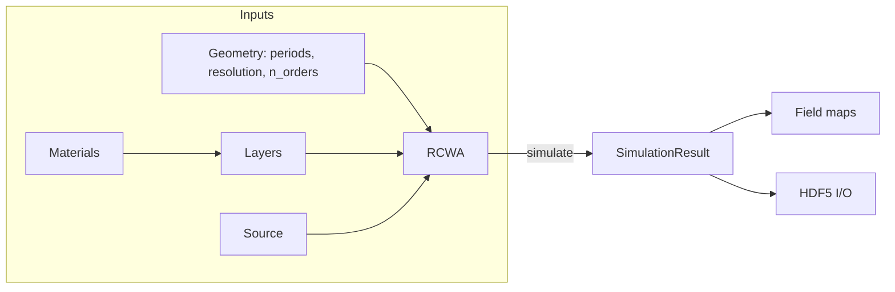

# Core Concepts

This chapter explains the objects you compose to run a simulation and how they map
onto the physics. Each concept links to its full [API reference](api/index.md).



## Geometry definition

A simulation lives on a single **unit cell** with periods `period_x`, `period_y`
(meters). Two resolutions are involved and must not be confused:

- **`resolution`** — the real-space grid on which each layer's permittivity is
  sampled to build the Fourier convolution matrices. Passed to `RCWA(...)` (a
  global default) and optionally per-layer.
- **`n_orders`** — the number of retained Fourier harmonics, `M`. This is the
  accuracy/cost knob; `resolution` only needs to be fine enough to represent the
  geometry and is internally raised to at least `4*M + 1`.

For a **1-D grating**, store the topology as an `(Nx, 2)` map and set
`n_orders=(M, 0)` so only x-orders are expanded.

## Materials

A [`Material`](api/materials-layers.md#material) maps wavelength to a complex
permittivity \(\varepsilon = (n+ik)^2\). Anywhere the API expects a material you
may pass:

| Specifier | Example | Meaning |
|---|---|---|
| Database name (`str`) | `"Si"` | a shipped or registered material |
| A number | `1.5`, `2.4+0.01j` | constant (non-dispersive) index |
| A JSON path (`str`) | `"my_mat.json"` | loaded on demand |
| A `Material` object | `Material.constant(2.0)` | used directly |

The [`MaterialLibrary`](api/materials-layers.md#materiallibrary) resolves these and
caches the result. A module-level `default_library` is shared by every `RCWA`
unless you pass your own. Built-in materials: **Air, Au, GaN, GaP, Si, Si₃N₄,
SiO₂, TiO₂, aSi**. See [Advanced → Custom materials](advanced.md#custom-materials)
to add your own from CSV or a Lorentz model.

!!! info "Sign convention"
    Ikarus uses \(\exp(-i\omega t)\): absorbing media have \(k>0\) and
    \(\mathrm{Im}(\varepsilon) > 0\). If you import data with gain-sign \(k\), the
    energy balance will exceed 1 — flip the sign of \(k\).

## Layers

A [`Layer`](api/materials-layers.md#layer) has a thickness and a recipe for its
permittivity \(\varepsilon(x, y)\). Two kinds:

- **Uniform** — one material fills the cell. Add with
  `add_uniform_layer(height, material)`.
- **Patterned** — an integer `topology` pixel map selects among a `materials`
  list (index `0` → `materials[0]`, etc.). Add with
  `add_layer(height, topology, materials)`.

### Stack rules (boundary layers)

The layer list is ordered **cover → … → substrate**:

- The **first** (cover) and **last** (substrate) layers must be **uniform and
  semi-infinite**: `height=np.inf`. They are the incidence and transmission
  half-spaces; the cover index sets the incident wavevector.
- All **interior** layers must have **finite** thickness.

Violating these raises a `ValueError` from `RCWA._validate_stack`.

## Unit cells & topology maps

A topology is an integer `numpy.ndarray` of shape `(Nx, Ny)`. You can build one by
hand or with the [`shapes`](api/shapes.md) primitives, which work in **fractional**
unit-cell coordinates in \([0, 1)\) so a shape is resolution-independent:

```python
from ikarus import shapes
disk = shapes.circle(center=(0.5, 0.5), radius=0.3, grid_shape=(128, 128))
ring = shapes.ring(inner_radius=0.2, outer_radius=0.35, grid_shape=(128, 128))
both = shapes.combine(disk, ring)   # overlay maps
```

A patterned layer resamples its topology (nearest-neighbour) to the solver's
sampling grid, so the topology resolution and `resolution` need not match.

## Sources

A [`Source`](api/source.md) is a monochromatic plane wave: vacuum `wavelength`,
direction (`theta` from \(+z\), `phi` from \(+x\), degrees) and polarization
(`linear` with `linear_pol_angle`, or `RCP`/`LCP`). Create or update it with
`set_source(**kwargs)`, which **retains** unspecified fields so a sweep can change
one parameter at a time. See [Polarization](tutorials/polarization.md) and
[Angular response](tutorials/angular-response.md).

## Boundary conditions

Two boundary conditions are built in and need no configuration:

- **Transverse:** Bloch-periodic over the unit cell — the field of harmonic
  \((m,n)\) carries the wavevector \(k_{x0} - m\,2\pi/\Lambda_x\), etc.
- **Longitudinal:** semi-infinite **radiation** conditions in the cover and
  substrate — only outgoing (or evanescently decaying) modes are kept, enforced by
  the forward-branch eigenvalue selection.

## Solvers

The numerically heavy work lives in the **stateless** `ikarus.core.solver`
(`solve_stack`). The user-facing `RCWA` object only collects inputs, calls the
solver and packages results, which keeps the engine easy to test and reuse. You
normally never call the solver directly; see [Low-level
API](api/low-level.md) if you want to.

Harmonic-order **convergence** is automated via
[`simulate(auto_converge=...)`](api/rcwa.md) and `ikarus.tools.convergence`.

## Result objects

[`simulate()`](api/rcwa.md) returns `(T, R, result)`:

- **`T`, `R`** — the convenience zero-order coefficients (complex scalar for
  linear polarization; `{"co", "cross"}` dict for circular).
- **`result`** — a [`SimulationResult`](api/rcwa.md#simulationresult) carrying
  totals (`R_total`, `T_total`), per-order arrays (`R_orders`, `T_orders`, with
  `orders = (p, q)`), exit angles, `energy_balance`, the zero-order phases
  (`R_phase`, `T_phase`) and the underlying `solution` for
  [field reconstruction](api/fields-viz.md).

A `FieldSolution` (the `result.solution`) can be turned into real-space
[`FieldMap`](api/fields-viz.md#fieldmap)s with `get_fields(...)`, and any result
can be written to / read from [HDF5](api/tools.md).
