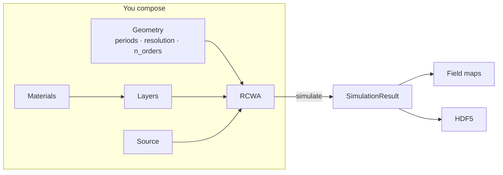

# Core Concepts

*The cast of characters.* Every Ikarus simulation is the same short play: a
**stage** (the unit cell), a **stack** of layers wearing **materials**, one
**light source**, and a **result** that tells you how the performance went.
This page introduces each character and how they fit together — with links to
their full [API pages](api/index.md).



## The stage — geometry

Everything happens on one **unit cell** with periods `period_x`, `period_y`
(meters), repeated to infinity in both directions. Two numbers govern the
numerics, and confusing them is the classic rookie mistake:

| Dial | What it controls | Mental model |
|---|---|---|
| `n_orders` | How many Fourier harmonics describe the *field* | the **accuracy/cost dial** — turn with intention |
| `resolution` | How many pixels sample the *geometry* | just needs to draw your shape — auto-raised to ≥ `4*M+1` |

For a **1-D grating** (pattern varies only along x), store the topology as an
`(Nx, 2)` map and set `n_orders=(M, 0)` — you'll get the physics of a 1-D
problem at a 1-D price.

## The wardrobe — materials

A [`Material`](api/materials-layers.md#material) maps wavelength to a complex
permittivity \(\varepsilon = (n+ik)^2\). Anywhere the API wants a material, you
can hand it:

| You pass | Example | You get |
|---|---|---|
| A database name | `"Si"` | dispersive tabulated data, spline-interpolated |
| A bare number | `1.5`, `2.4 + 0.01j` | constant index — instant test material |
| A JSON path | `"my_mat.json"` | loaded on demand |
| A `Material` object | `Material.constant(2.0)` | used as-is |

The [`MaterialLibrary`](api/materials-layers.md#materiallibrary) resolves and
caches all of these; a shared `default_library` ships with **Air, Au, GaN, GaP,
Si, Si₃N₄, SiO₂, TiO₂, aSi**. Adding your own from CSV or a Lorentz model takes
one call — see [Aerobatics → Custom materials](advanced.md#custom-materials).

!!! warning "The sign that bites"
    Ikarus speaks \(\exp(-i\omega t)\): **absorbers have \(k > 0\)**. Import
    data with the opposite sign and your structure becomes a laser — the energy
    balance exceeding 1 is the tell.

## The stack — layers

A [`Layer`](api/materials-layers.md#layer) is a thickness plus a recipe for
\(\varepsilon(x, y)\). Two flavors:

```python
rcwa.add_uniform_layer(np.inf, "Air")               # uniform: one material
rcwa.add_layer(200e-9, topology, ["Air", "Si"])     # patterned: pixel map
```

The patterned `topology` is an integer array; index `0` wears `materials[0]`,
index `1` wears `materials[1]`, and so on.

**The stack rules** (Ikarus validates them and refuses bad stacks):

1. Layers are listed **cover → … → substrate** (sky to ground).
2. First and last layer: **uniform + semi-infinite** (`height=np.inf`). The
   cover's index sets the incident wavevector.
3. Interior layers: **finite** thickness, any number, any mix of flavors.

## The scenery — topologies and shapes

You can draw a topology by hand (it's just a NumPy integer array) or use the
[`shapes`](api/shapes.md) primitives, which work in **fractional** unit-cell
coordinates \([0, 1)\) so your design is resolution-independent:

```python
from ikarus import shapes

disk = shapes.circle(center=(0.5, 0.5), radius=0.3, grid_shape=(128, 128))
ring = shapes.ring(inner_radius=0.2, outer_radius=0.35, grid_shape=(128, 128))
both = shapes.combine(disk, ring)     # overlay several maps
```

The layer resamples its topology (nearest-neighbour) onto the solver's grid, so
topology resolution and `resolution` don't need to match.

## The light — sources

A [`Source`](api/source.md) is one monochromatic plane wave: vacuum
`wavelength`, direction (`theta` from \(+z\), `phi` from \(+x\), degrees), and
polarization (`linear` + `linear_pol_angle`, or `RCP`/`LCP`).

The killer convenience: `set_source(**kwargs)` **remembers**. After the first
call it updates only what you pass — so sweeps mutate one parameter at a time:

```python
rcwa.set_source(wavelength=600e-9, theta=0, polarization="linear")
rcwa.set_source(theta=15)          # wavelength & polarization retained
```

## The physics you get for free — boundary conditions

Nothing to configure:

- **Sideways:** Bloch periodicity over the unit cell — harmonic \((m,n)\)
  carries wavevector \(k_{x0} - m\,2\pi/\Lambda_x\), etc.
- **Up/down:** radiation conditions in the semi-infinite cover and substrate —
  only outgoing or decaying modes survive, enforced by the solver's
  forward-branch eigenvalue selection.

## The engine room — solvers

The numerically heavy lifting lives in the **stateless**
`ikarus.core.solver` (`solve_stack`): geometry and source in, modal solution
out, no hidden state. The `RCWA` object you actually touch is a thin director —
it validates the stack, calls the engine, and packages the output. You'll
likely never call the solver directly, but it's public and documented in the
[Low-level API](api/low-level.md) if you want to lift the hood.

Harmonic convergence can be automated:
`simulate(auto_converge="once")` finds and caches a sufficient `n_orders`
([Tools](api/tools.md)).

## The flight report — results

[`simulate()`](api/rcwa.md) returns `(T, R, result)`:

- **`T`, `R`** — zero-order complex amplitudes (or `{"co", "cross"}` dicts for
  circular light).
- **`result`** — a [`SimulationResult`](api/rcwa.md#simulationresult): totals,
  per-order efficiencies with `(p, q)` labels, exit angles (`NaN` =
  evanescent), `energy_balance`, zero-order phases, and the raw `solution` for
  [field reconstruction](api/fields-viz.md).

From there, `get_fields(...)` turns the modal solution into real-space
[`FieldMap`](api/fields-viz.md#fieldmap)s, and
[`save_results`](api/tools.md) writes everything to self-describing HDF5.

<hr class="wing">

*Characters introduced. See them act:* [Flight School →](tutorials/index.md)
