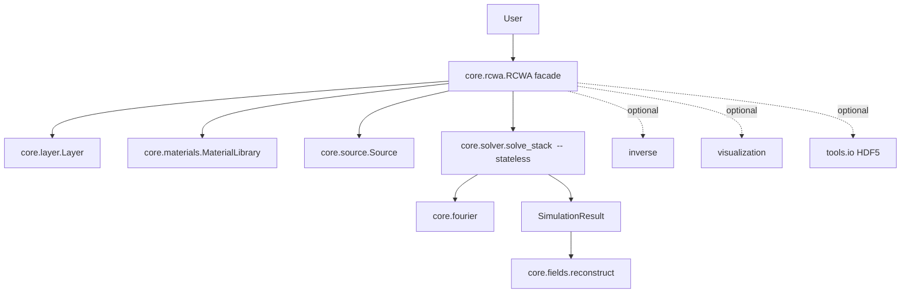

# Developer Guide

## Repository structure

```text
ikarus/
├── __init__.py            # public API surface (re-exports)
├── core/                  # the solver engine
│   ├── rcwa.py            #   RCWA facade + SimulationResult
│   ├── solver.py          #   stateless linear algebra: modes, S-matrices, cascade
│   ├── source.py          #   Source (plane-wave illumination)
│   ├── layer.py           #   Layer (uniform / patterned)
│   ├── materials.py       #   Material, MaterialLibrary, default_library
│   ├── fourier.py         #   HarmonicGrid, convolution_matrix
│   ├── fields.py          #   FieldMap, real-space reconstruction
│   └── polarization.py    #   circular co/cross decomposition
├── inverse/               # gradient-free inverse design (optional: pymoo)
│   ├── dof.py             #   MetaAtom, free, pixels
│   ├── targets.py         #   Target (figures of merit)
│   └── optimize.py        #   optimize(), OptimizeResult
├── shapes/                # topology primitives
│   └── primitives.py
├── tools/                 # convergence, HDF5 I/O, material CLI
│   ├── convergence.py
│   ├── io.py              #   (optional: h5py)
│   └── add_material.py    #   `ikarus-add-material` console script
├── visualization/         # matplotlib helpers (optional: matplotlib)
│   ├── structure.py
│   └── fields.py
├── examples/              # runnable example scripts
├── materials/             # shipped material database (*.json)
└── tests/                 # pytest suite
    └── validation/        # analytic Fresnel + 1-D grating references
```



## Internal architecture

The design separates a **stateless numerical core** from a **stateful façade**:

- `core.solver.solve_stack` is a pure function: geometry + source in, a
  `FieldSolution` out. It holds no state and is independently testable. This is
  where the eigenmodes, scattering matrices and Redheffer cascade live.
- `core.rcwa.RCWA` collects user inputs, validates the stack, calls the solver and
  *packages* the result (`SimulationResult`). It owns the convenience features —
  field extraction, visualization hooks, I/O, auto-convergence.
- **Optional features are lazily imported** inside the methods that use them, so
  the core never hard-depends on matplotlib, h5py or pymoo.

Key numerical decisions worth knowing before you touch the solver:

- **Scattering-matrix (Redheffer) cascade**, not transfer matrices — for
  unconditional stability with thick/evanescent layers.
- **Consistent forward-branch eigenvalue selection** (`_forward_branch`,
  `uniform_modes`) across gap, regions and patterned layers — required for correct
  evanescent-mode signs in diffraction gratings.
- **No explicit inverses** in hot paths — `scipy.linalg.solve` right-division
  (`_rdiv`) for the star product, diagonal broadcasting for homogeneous regions.
- **Physics \(\exp(-i\omega t)\)** convention externally; the solver works in the
  engineering convention internally and conjugates at the boundary
  (`core.fields`, `core.rcwa`).

## How to contribute

1. Fork and clone; create a feature branch.
2. Install in editable mode with the dev extras:
   ```bash
   pip install -e ".[dev]"
   ```
3. Make your change with a test that fails before and passes after.
4. Run the suite and ensure no regressions (`pytest`).
5. Open a pull request describing the change and the validation you ran.

Good first contributions, mapped to the roadmap gaps:

- **Li's inverse-rule factorization** for faster TM/metal convergence.
- **Anisotropic (3×3 tensor) materials** in `core.layer` / `core.solver`.
- Additional database materials (with a cited source) under `ikarus/materials/`.
- More worked examples and tutorials.

## Testing

The suite uses **pytest**; `testpaths` is `ikarus/tests`.

```bash
pytest                      # everything
pytest ikarus/tests/validation -q     # the physics validation only
pytest -k fresnel           # a subset by keyword
```

The validation tests (`ikarus/tests/validation/`) are the correctness backbone:

- `test_fresnel.py` — single-interface and slab reflectance/transmittance vs. the
  analytic Fresnel/transfer-matrix solution (machine precision).
- `test_grating.py` — a 1-D grating vs. an independent mode-matching reference and
  energy conservation.

When changing the solver, treat these as the gate: they catch branch-selection,
convention and conditioning regressions that unit tests miss. Add a validation
case for any new physics.

## Documentation generation

The docs are built with **MkDocs** + the **Material** theme (this site).

```bash
pip install -r requirements-docs.txt
mkdocs serve      # live preview at http://127.0.0.1:8000
mkdocs build      # static site -> ./site
```

- Pages live under `docs/`; the navigation and theme are configured in
  `mkdocs.yml`.
- Math uses `pymdownx.arithmatex` + MathJax (`docs/javascripts/mathjax.js`);
  diagrams use Mermaid via `pymdownx.superfences`.
- A GitHub Actions workflow (`.github/workflows/docs.yml`) builds with
  `--strict` and deploys to GitHub Pages on every push to `main`. Enable Pages
  once under *Settings → Pages → Source: GitHub Actions*.

!!! tip "Auto-generated API docs (optional)"
    The API pages here are written by hand for stability. If you prefer to generate
    them from docstrings, add [`mkdocstrings`](https://mkdocstrings.github.io/) to
    the docs requirements and replace an API page body with a `::: ikarus.RCWA`
    block — the codebase is already richly docstringed.

## Coding standards

- **Python ≥ 3.9**, `from __future__ import annotations` at the top of modules.
- **Type hints** on public signatures; `@dataclass` for plain data carriers
  (`Source`, `Layer`, `SimulationResult`, `FieldMap`, `SMatrix`).
- **SI units** (meters) everywhere; the \(\exp(-i\omega t)\) convention with
  \(k>0\) for loss.
- **Docstrings** on every public class/function, with a one-line summary, the
  parameters and the conventions used.
- **Lazy-import optional dependencies** inside the function that needs them, and
  raise a clear `ImportError` pointing at the right extra.
- Keep the **numerical core stateless and inverse-free** in hot paths; prefer
  `scipy.linalg.solve` over `inv`.
- Match the surrounding style (naming, comment density) when editing a module.
