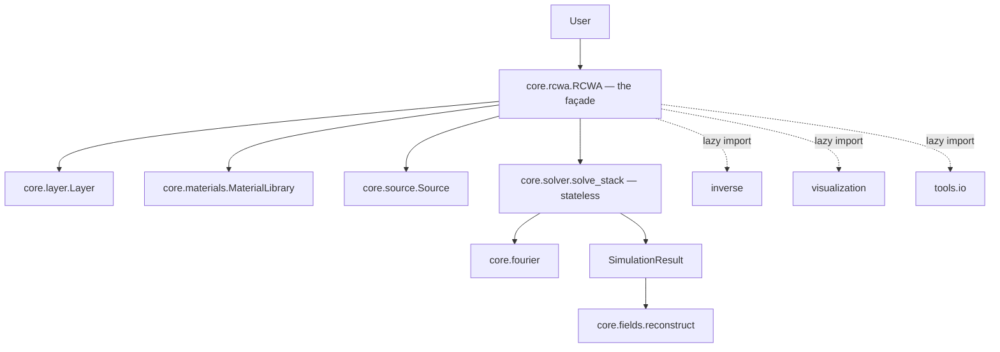

# Developer Guide

*Build your own wings.* Everything you need to navigate, extend and test the
codebase — plus the architectural decisions that keep it honest.

## Repository map

```text
ikarus/
├── __init__.py            # public API surface (re-exports)
├── core/                  # the engine
│   ├── rcwa.py            #   RCWA façade + SimulationResult
│   ├── solver.py          #   stateless heart: modes, S-matrices, cascade
│   ├── source.py          #   Source (plane-wave illumination)
│   ├── layer.py           #   Layer (uniform / patterned)
│   ├── materials.py       #   Material, MaterialLibrary, default_library
│   ├── fourier.py         #   HarmonicGrid, convolution_matrix
│   ├── fields.py          #   FieldMap, real-space reconstruction
│   └── polarization.py    #   circular co/cross decomposition
├── inverse/               # gradient-free inverse design (opt: pymoo)
│   ├── dof.py             #   MetaAtom, free, pixels
│   ├── targets.py         #   Target (figures of merit)
│   └── optimize.py        #   optimize(), OptimizeResult
├── shapes/                # topology primitives
├── tools/                 # convergence, HDF5 I/O, material CLI
├── visualization/         # matplotlib helpers (opt: matplotlib)
├── examples/              # runnable demo scripts
├── materials/             # shipped material database (*.json)
└── tests/                 # pytest suite
    └── validation/        #   analytic Fresnel + 1-D grating references
```



## The architecture in one idea

**A stateless numerical core behind a stateful façade.**

- `core.solver.solve_stack` is a pure function: geometry + source in,
  `FieldSolution` out, no hidden state. Eigenmodes, scattering matrices and
  the Redheffer cascade all live here — independently testable, reusable,
  auditable.
- `core.rcwa.RCWA` collects user input, validates the stack, calls the engine
  and packages results. Convenience features (fields, plots, I/O,
  auto-convergence) hang off the façade, never off the core.
- **Optional dependencies are imported lazily** inside the methods that need
  them — the core never hard-depends on matplotlib, h5py or pymoo, and each
  raises a clear `ImportError` naming the right extra.

Numerical decisions you should know before touching the solver:

| Decision | Why |
|---|---|
| Scattering-matrix (Redheffer) cascade, never transfer matrices | unconditional stability for thick/evanescent layers |
| One consistent forward-branch eigenvalue rule (`_forward_branch`, `uniform_modes`) | wrong-branch evanescent modes silently corrupt every grating |
| No explicit inverses in hot paths — `scipy.linalg.solve` right-division | speed *and* conditioning |
| Physics \(\exp(-i\omega t)\) outside, engineering convention inside, conjugation at the boundary | matches both the literature and the reference formulations |

## Contributing

1. Fork, clone, branch.
2. `pip install -e ".[dev]"`
3. Make the change **with a test that fails before and passes after**.
4. `pytest` — no regressions.
5. PR with a description of the change and the validation you ran.

Wish-list items, mapped to the known gaps:

- **Tilted-optic-axis anisotropy** (`eps_xz`/`eps_yz`) and magneto-optic
  gyrotropy — the in-plane + z tensor shipped in 0.9.0; the fully general
  tensor changes the P matrix as well as Q.
- **Parallel sweeps** (`Sweep.run(workers=N)`) and reuse of identical-layer
  eigensolves across a stack and across optimizer populations.
- **Absorption analysis** — per-layer absorbed power and absorption-density
  maps from the existing field machinery.
- New database materials (with a cited source) under `ikarus/materials/`.
- More worked examples and tutorials.

## Testing

Pytest; `testpaths` is `ikarus/tests`:

```bash
pytest                                 # everything
pytest ikarus/tests/validation -q      # the physics gate only
pytest -k fresnel                      # subset by keyword
```

The **validation suite** is the project's conscience:

- `test_fresnel.py` — single interfaces and slabs vs. the analytic
  Fresnel/transfer-matrix solution, to machine precision.
- `test_grating.py` — a 1-D grating vs. an independent mode-matching
  reference, plus energy conservation.

Treat these as the merge gate for solver changes: they catch branch-selection,
convention and conditioning regressions that unit tests sail past. New physics
⇒ new validation case. No exceptions — this is how the wings stay attached.

## Building these docs

MkDocs + Material (the site you're reading):

```bash
pip install -r requirements-docs.txt
mkdocs serve      # live preview at http://127.0.0.1:8000
mkdocs build      # static site -> ./site
```

- Content in `docs/`, configuration in `mkdocs.yml`, theme tweaks in
  `docs/stylesheets/extra.css`, announcement bar in `overrides/main.html`.
- Math: `pymdownx.arithmatex` + MathJax (with `\llbracket`/`\rrbracket` macros
  defined in `docs/javascripts/mathjax.js`). Diagrams: Mermaid via
  `pymdownx.superfences`. Icons: `pymdownx.emoji` (Material/Octicons SVGs).
- **Figures** are real Ikarus output, not mock-ups. Regenerate them with
  `python scripts/gen_docs_figures.py` — it runs the solver and writes the PNGs
  into `docs/assets/`. Re-run after any change that should be reflected in the
  embedded plots.
- CI: `.github/workflows/docs.yml` builds with `--strict` and deploys to
  GitHub Pages on every push to `main`.

!!! tip "Docstring-generated API pages (optional)"
    The API reference is hand-written for stability. Prefer generation? Add
    [`mkdocstrings`](https://mkdocstrings.github.io/) and replace a page body
    with a `::: ikarus.RCWA` block — the codebase is richly docstringed.

## House style

- Python ≥ 3.9, `from __future__ import annotations` at module top.
- Type hints on public signatures; `@dataclass` for plain data carriers.
- **SI units**, \(\exp(-i\omega t)\), \(k>0\) for loss — everywhere, always.
- Docstrings on every public name: one-line summary, parameters, conventions.
- Lazy-import optional dependencies; raise an `ImportError` that names the fix.
- Keep the core **stateless** and the hot paths **inverse-free**.
- Match the surrounding code's style when editing — the codebase reads as one
  voice, and that's a feature.
