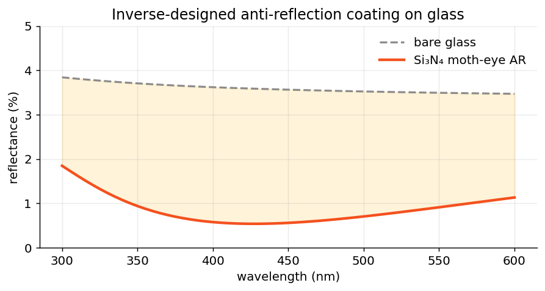

# The Hangar

*Complete, runnable aircraft — climb in and turn the key.* The first squadron
ships inside the package as modules; the rest are copy-paste recipes. SI units
everywhere, as always.

## The shipped squadron

| Script | Run | What it flies |
|---|---|---|
| Feature tour | `python -m ikarus.examples.feature_tour` | The full airshow: TiO₂ cross metasurface — materials, structure plots, order-resolved efficiencies, field maps, spectrum, circular polarization, HDF5. Output lands in `ikarus_tour_output/`. |
| Grating diffraction | `python -m ikarus.examples.grating_diffraction` | 1-D TiO₂ binary grating; propagating orders + exit angles vs. wavelength. |
| Metasurface spectrum | `python -m ikarus.examples.metasurface_spectrum` | R/T spectrum of a 2-D meta-atom. |
| Inverse metamirror | `python -m ikarus.examples.inverse_metamirror` | A GA evolves a reflective meta-atom. |
| Fresnel validation | `python -m ikarus.examples.validation_fresnel` | The machine-precision sanity anchor. |

## Fresnel validation — the trust anchor

Before believing any solver, make it reproduce something you can derive by
hand. One interface, analytic answer, fifteen decimal places:

```python
import numpy as np
from ikarus import RCWA

rcwa = RCWA(period_x=1e-6, period_y=1e-6, n_orders=0)   # specular only
rcwa.add_uniform_layer(np.inf, 1.0)      # air
rcwa.add_uniform_layer(np.inf, 1.5)      # glass (constant index)

rcwa.set_source(wavelength=600e-9, theta=0, polarization="linear")
_, _, res = rcwa.simulate()

R_fresnel = ((1.0 - 1.5) / (1.0 + 1.5)) ** 2
print(f"Ikarus  R = {res.R_total:.12f}")
print(f"Fresnel R = {R_fresnel:.12f}")
print(f"|diff| = {abs(res.R_total - R_fresnel):.2e}")   # ~1e-15 
```

## Anti-reflection thin film — the classic

The quarter-wave trick, in eight lines:

```python
import numpy as np
from ikarus import RCWA

n_film, lam0 = 1.23, 550e-9          # ideal AR index ≈ sqrt(1.5)
d = lam0 / (4 * n_film)              # quarter-wave thickness

rcwa = RCWA(period_x=1e-6, period_y=1e-6, n_orders=0)
rcwa.add_uniform_layer(np.inf, 1.0)
rcwa.add_uniform_layer(d, n_film)
rcwa.add_uniform_layer(np.inf, 1.5)

for wl in (450e-9, 550e-9, 650e-9):
    rcwa.set_source(wavelength=wl, theta=0, polarization="linear")
    print(f"{wl*1e9:.0f} nm: R = {rcwa.simulate()[2].R_total:.4f}")
# the minimum sits at 550 nm, as designed
```

## Guided-mode resonance filter — the drama queen

A high-index grating that doubles as a waveguide: at just the right wavelength
the light couples in, circulates, and exits as a needle-sharp reflection peak.

```python
import numpy as np
from ikarus import RCWA

period = 880e-9
rcwa = RCWA(period_x=period, period_y=period, resolution=(256, 2), n_orders=(25, 0))

topo = np.zeros((200, 2), dtype=int)
topo[:100, :] = 1                     # 50% duty cycle
rcwa.add_uniform_layer(np.inf, "Air")
rcwa.add_layer(180e-9, topo, ["Si3N4", "Air"])
rcwa.add_uniform_layer(np.inf, "SiO2")

for wl in np.linspace(1.0e-6, 1.1e-6, 11):
    rcwa.set_source(wavelength=wl, theta=0, polarization="linear", linear_pol_angle=0)
    print(f"{wl*1e9:.0f} nm: R = {rcwa.simulate()[2].R_total:.3f}")
    # a narrow resonance spikes inside the band
```

## Inverse design: AR coating { #inverse-design-ar-coating }

No solid material has the n ≈ 1.21 a glass AR coating wants — so let evolution
build one out of *structure*: a subwavelength Si₃N₄ moth-eye whose fill
fraction fakes the unattainable index. Broadband 300–600 nm, worst-case
optimized:

```python
import os
for v in ("OMP_NUM_THREADS", "OPENBLAS_NUM_THREADS", "MKL_NUM_THREADS"):
    os.environ.setdefault(v, "1")        # single-thread BLAS for the tight loop

import numpy as np
from ikarus.inverse import MetaAtom, free, pixels, Target, optimize

atom = MetaAtom(period=180e-9, cover="Air", substrate="SiO2")
atom.add_pattern(topology=pixels(8, 8, symmetry="c4v"),
                 materials=["Air", "Si3N4"], height=free(40e-9, 200e-9))

target = Target.minimize("R", band=(300e-9, 600e-9, 6), worst_case=True)
best = optimize(atom, target, n_orders=6, pop=16, n_gen=10, seed=0)
print(best.report())

coating = best.metaatom
wl = np.linspace(300e-9, 600e-9, 13)
R = []
for w in wl:
    coating.set_source(wavelength=w, theta=0, polarization="linear")
    R.append(coating.simulate()[2].R_total)
print("worst-case R:", f"{max(R)*100:.2f}%")     # ~1.5% vs ~3.8% bare glass
```

<figure markdown="span">
  { width="640" }
  <figcaption>An inverse-designed subwavelength Si₃N₄ moth-eye cuts glass reflection from ~3.5–4% (bare) to ~1% across the visible.</figcaption>
</figure>

## Beam deflector — power steering

Maximize power into the +1 reflected order at 1550 nm:

```python
import os
os.environ.setdefault("OMP_NUM_THREADS", "1")
from ikarus.inverse import MetaAtom, free, pixels, Target, optimize

atom = MetaAtom(period=1.2e-6, cover="Air", substrate="SiO2")
atom.add_pattern(topology=pixels(16, 4, symmetry="mirror_y"),
                 materials=["Air", "Si"], height=free(0.2e-6, 0.6e-6))

best = optimize(atom, Target.maximize("R", order=(1, 0), at=1550e-9),
                n_orders=(12, 4), pop=40, n_gen=30)
print(best.report())
```

<hr class="wing">

**Continue exploring:** [Flight School](tutorials/index.md) for the step-by-step
versions · [API Reference](api/index.md) for every knob ·
[Need for Speed](performance.md) for making big runs fast.
