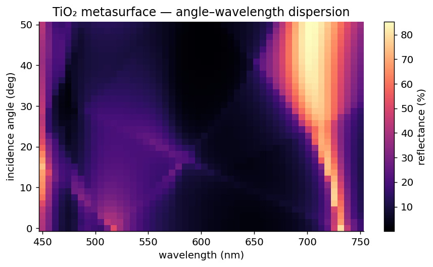

---
hide:
  - toc
---

<div class="ikarus-hero" markdown>


# Fly closer to the sun 

**Ikarus** is a high-precision RCWA engine for periodic photonics —
metasurfaces, gratings and photonic crystals — with machine-precision
validation, real-space field maps and inverse design built in.
Pure NumPy/SciPy. No mesh. No time stepping. Just light, decomposed.

[Take your first flight](quickstart.md){ .md-button .md-button--primary }
[How RCWA works](theory.md){ .md-button }
[API reference](api/index.md){ .md-button }

</div>

```python
import numpy as np
from ikarus import RCWA

rcwa = RCWA(period_x=1e-6, period_y=1e-6, resolution=64, n_orders=15)
rcwa.add_uniform_layer(height=np.inf, material="Air")    # the sky
rcwa.add_uniform_layer(height=200e-9, material="Si")     # the obstacle
rcwa.add_uniform_layer(height=np.inf, material="SiO2")   # the landing zone
rcwa.set_source(wavelength=1550e-9, theta=0, polarization="linear")

T, R, result = rcwa.simulate()
print(f"R = {result.R_total:.4f}  T = {result.T_total:.4f}  "
      f"R+T = {result.energy_balance:.6f}")   # the books always balance
```

<div class="ikarus-stats" markdown>
<div markdown><span class="stat-number">~10⁻¹⁵</span><span class="stat-label">agreement with analytic Fresnel</span></div>
<div markdown><span class="stat-number">1.5–1.7×</span><span class="stat-label">faster than grcwa, head-to-head</span></div>
<div markdown><span class="stat-number">9</span><span class="stat-label">dispersive materials built in</span></div>
<div markdown><span class="stat-number">1</span><span class="stat-label">pip install, zero config</span></div>
</div>

---

<figure class="hero-figure" markdown="span">
  { width="720" }
  <figcaption>A TiO₂ metasurface's angle–wavelength reflectance fingerprint — Rayleigh–Wood anomalies and all — computed in seconds. (See [Flight School, Lesson 6](tutorials/angular-response.md).)</figcaption>
</figure>

## Pick your runway

<div class="grid cards" markdown>

-   :material-clock-fast:{ .lg .middle } **Five minutes to first photon**

    ---

    Install with pip, build a three-layer stack, get reflectance,
    transmittance and phase — with every input explained.

    [:octicons-arrow-right-24: Quick Start](quickstart.md)

-   :material-sine-wave:{ .lg .middle } **Understand the machine**

    ---

    RCWA explained like you're a photon: harmonics as exit lanes,
    layers with natural gaits, scattering matrices whose wax never melts.

    [:octicons-arrow-right-24: How RCWA Works](theory.md)

-   :material-school:{ .lg .middle } **Flight School**

    ---

    Six hands-on lessons: spectra, gratings, metasurfaces, sweeps,
    polarization and oblique incidence. All copy-paste runnable.

    [:octicons-arrow-right-24: Tutorials](tutorials/index.md)

-   :material-dna:{ .lg .middle } **Let the machine design for you**

    ---

    Declare *what you want* — "minimize reflection from 300 to 600 nm" —
    and a genetic algorithm sculpts the metaatom. Three lines of intent.

    [:octicons-arrow-right-24: Inverse Design](api/inverse.md)

</div>

---

## Why Ikarus exists

Most research RCWA codes are either terse academic scripts (fast, but you need
the author in the room to modify them) or heavyweight frameworks (powerful, but
the setup costs a weekend). Ikarus aims for the missing third thing:

- **A readable, decomposed engine.** The numerically heavy core is *stateless*
  and lives apart from the user-facing façade, the material database and the
  Fourier machinery. Every piece is independently testable — and tested.
- **Correctness you can audit.** A validation suite checks the engine against
  the analytic Fresnel solution (to ~10⁻¹⁵) and an independent mode-matching
  reference. Energy is conserved to ~10⁻⁹ for lossless gratings.
- **An API that respects your time.** Full per-order, vectorial results —
  efficiencies, complex amplitudes, exit angles, fields — without ceremony.
- **Inverse design in the box.** The same metaatom you simulate forward can be
  optimized backward, gradient-free, with one function call.

!!! example "Myth break — why \"Ikarus\"?"

    In the myth, Ikaros strapped on wings of wax and feathers, ignored the
    flight envelope, and performed an unscheduled rapid disassembly over the
    Aegean. Our Ikarus is built differently: the **scattering-matrix cascade**
    is *unconditionally stable* — thick layers, evanescent waves, lossy metals —
    crank them all you like. The wax doesn't melt.
    (Transfer-matrix codes, on the other hand… [see the Theory chapter](theory.md).)

## What's in the toolbox

| Capability | Status |
|---|---|
| 2-D periodic structures (crossed gratings, metasurfaces) | :material-check:{ .feat-yes } |
| Pixel-map topologies + shape primitives (circle, ring, polygon, …) | :material-check:{ .feat-yes } |
| Linear polarization (any angle), oblique incidence | :material-check:{ .feat-yes } |
| Circular polarization with co/cross-pol decomposition | :material-check:{ .feat-yes } |
| All diffraction orders with exit angles | :material-check:{ .feat-yes } |
| Dispersive material database (Si, SiO₂, TiO₂, GaN, GaP, aSi, Au, Si₃N₄, Air) | :material-check:{ .feat-yes } |
| Custom materials from CSV (`n, k`) or a Lorentz model | :material-check:{ .feat-yes } |
| Real-space field reconstruction (xy / xz / yz planes) | :material-check:{ .feat-yes } |
| Structure & field visualization (matplotlib) | :material-check:{ .feat-yes } |
| Automatic convergence testing (`never` / `once` / `always`) | :material-check:{ .feat-yes } |
| HDF5 export / import of results | :material-check:{ .feat-yes } |
| Numerically stable S-matrix cascade (no transfer-matrix overflow) | :material-check:{ .feat-yes } |
| Li inverse-rule factorization — fast TM / high-contrast convergence, on by default | :material-check:{ .feat-yes } |
| Gradient-free inverse design — single-layer or multi-layer (pixels, parametric shapes, `Structure`; GA / NSGA-III) | :material-check:{ .feat-yes } |
| Declarative parameter sweeps + progress bars (`Sweep`, `progress`) | :material-check:{ .feat-yes } |
| Anisotropic (3×3 tensor) materials | :material-close:{ .feat-no } on the roadmap |
| Off-diagonal normal-vector factorization (sub-pixel curved boundaries) | :material-close:{ .feat-no } two-step diagonal rule shipped |
| GPU acceleration | :material-close:{ .feat-no } CPU (NumPy/SciPy) only |

## Sixty seconds of metasurface

A square lattice of TiO₂ disks on glass — the classic metasurface building block:

```python
import numpy as np
from ikarus import RCWA, shapes

period = 500e-9
disk = shapes.circle(center=(0.5, 0.5), radius=0.3, grid_shape=(128, 128))

rcwa = RCWA(period_x=period, period_y=period, resolution=(128, 128), n_orders=(10, 10))
rcwa.add_uniform_layer(np.inf, "Air")
rcwa.add_layer(220e-9, disk, ["Air", "TiO2"])   # topology 0 -> Air, 1 -> TiO2
rcwa.add_uniform_layer(np.inf, "SiO2")
rcwa.set_source(wavelength=600e-9, theta=0, polarization="linear")

T, R, result = rcwa.simulate()
print(f"T = {result.T_total:.3f}")
print(f"specular (0,0) order = {result.T_orders[result.order_index(0, 0)]:.3f}")
```

Want the full show — structure plots, field maps, spectra, circular
polarization, HDF5? One command:

```bash
python -m ikarus.examples.feature_tour
```

<hr class="wing">

<p style="text-align: center;">
<em>Ready for takeoff?</em> &nbsp;
<a href="installation/">Strap on the wings →</a>
</p>
