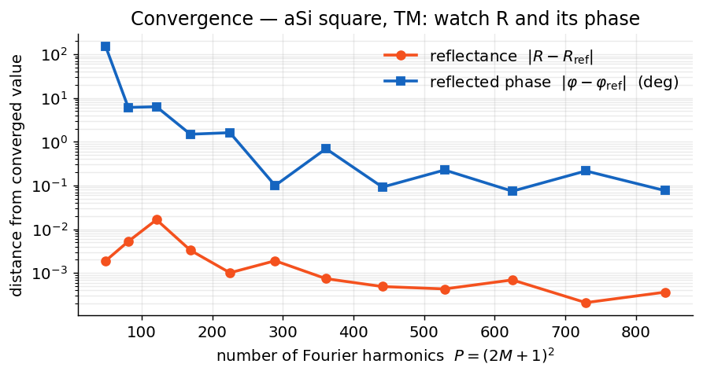

# Need for Speed

*What a solve costs, where the time goes, and the two tricks worth an order of
magnitude.*

## The price of harmonics

Everything is governed by one number — the harmonic count

\[
P = (2M_x + 1)(2M_y + 1)
\]

for `n_orders = (Mx, My)`. Each patterned layer demands one dense
eigendecomposition of a \(2P \times 2P\) matrix, and the scattering algebra
moves \(2P \times 2P\) blocks around. So, per layer:

\[
\text{time} \sim \mathcal{O}(P^3), \qquad \text{memory} \sim \mathcal{O}(P^2).
\]

Read that cubic again: doubling \(M\) in 2-D quadruples \(P\) and costs you
**~64× the time**. The consequences, in order of importance:

1. **`n_orders` is the throttle.** Find the smallest converged value
   ([the ritual](tutorials/parameter-sweeps.md#convergence-study)) and stop.
2. **1-D gratings fly economy for free:** `n_orders=(M, 0)` gives
   \(P = 2M+1\) — linear, not quadratic.
3. **Uniform layers cost nothing.** Their modes are analytic; a thin-film
   stack at `n_orders=0` is effectively instant.

## Indicative single-solve timings

One 2-D solve of a patterned layer, single thread — orders of magnitude, not a
contract (your CPU and BLAS will vary):

| \(M\) | harmonics \(P\) | matrix size \(2P\) | time |
|---:|---:|---:|---|
| 5 | 121 | 242 | ~0.1 s |
| 8 | 289 | 578 | ~0.4 s |
| 9 | 361 | 722 | ~1 s |
| 12 | 625 | 1250 | ~4 s |
| 13 | 729 | 1458 | ~8 s |
| 15 | 961 | 1922 | ~20 s |

From \(M=9\) to \(M=13\): \(P\) doubles, time ×8. The cube never sleeps.

!!! info "How Ikarus stacks up"
    Head-to-head against the independent
    [grcwa](https://github.com/weiliangjinca/grcwa) (both tools fed
    byte-identical material data), Ikarus agreed on \(R\), \(T\) and phase to
    ~10⁻³ while running **~1.5–1.7× faster per solve** (729 harmonics: ~8 s vs
    ~13 s). The margin comes from exploiting identity gap modes
    (\(W_0 = I\)), diagonal algebra in homogeneous regions, and
    `scipy.linalg.solve` right-division instead of explicit inverses.

<figure markdown="span">
  { width="640" }
  <figcaption>Convergence of what you actually use — total reflectance R and the zero-order reflected phase, plotted as distance from a high-order reference, for a high-contrast aSi square in TM. Coefficient stability like this, not the energy balance |R+T−1|, is the convergence test.</figcaption>
</figure>

## Memory scaling { #memory-scaling }

The heavyweights are \(2P \times 2P\) complex128 matrices — several live per
patterned layer at \((2P)^2 \times 16\) bytes apiece:

| \(M\) | \(2P\) | one matrix |
|---:|---:|---:|
| 5 | 242 | ~0.9 MB |
| 8 | 578 | ~5 MB |
| 10 | 882 | ~12 MB |
| 12 | 1250 | ~25 MB |
| 15 | 1922 | ~59 MB |
| 20 | 3362 | ~181 MB |

Budget a handful per layer. Deep stacks at large \(M\): lower `n_orders`,
or run fewer solves simultaneously.

## BLAS threading { #blas-threading }

The most impactful knob in the whole chapter — and it's two lines.

**Tight loops of small solves** (sweeps, GA populations): the matrices are too
small for threaded BLAS to win; it burns the time spawning and synchronizing
threads instead. **Pin one thread per process** and parallelize at the process
level:

```python
import os
for v in ("OMP_NUM_THREADS", "OPENBLAS_NUM_THREADS",
          "MKL_NUM_THREADS", "VECLIB_MAXIMUM_THREADS"):
    os.environ.setdefault(v, "1")
import numpy as np  # noqa: E402 — must come AFTER the env vars
```

In our testing this made an inverse-design run **roughly an order of magnitude
faster** on a many-core machine. Not a typo.

**Large single solves** (\(M \gtrsim 20\)): the opposite regime — one
eigendecomposition is big enough to feed every core. Let BLAS thread,
parallelize coarser. When in doubt, benchmark both; it takes two minutes.

## Convergence cheat sheet

| Structure | Typical `n_orders` | Notes |
|---|---|---|
| Thin films (uniform) | `0` | exact, instant |
| Gentle dielectric metasurfaces | 8–12 | TE and TM both quick |
| High-contrast dielectric | 12–18 | verify TM specifically |
| Metals, TM / p-pol | 18–30+ | the slow lane — see below |
| 1-D gratings | `(15–30, 0)` | cheap because 1-D |

Always converge at your **worst-case** wavelength/polarization, watching that
\(R\) and its phase have stopped moving — not \(|R+T-1|\), which a lossless
structure satisfies at every truncation.

!!! tip "Normal-vector factorization (default)"
    Ikarus factors the permittivity with the **normal-vector method** (Fast
    Fourier Factorization) by default (`factorization="auto"`): the inverse rule
    is applied along the true local boundary normal, so sharp
    high-contrast/metallic edges *and* curved boundaries converge fast —
    high-contrast TM gratings settle by
    \(n_{\text{orders}}\approx 10\text{–}15\) instead of drifting. On
    axis-aligned geometry it reduces exactly to Li's inverse rule (`"li"`, the
    default through v0.7). It is automatic for any topology and any number of
    materials; `"li"`, `"laurent"` and `"normal"` remain as explicit overrides
    for benchmarking ([RCWA → Factorization](api/rcwa.md#factorization)).
    **Watch out:** for high-contrast TM, \(|R+T-1|\approx 0\) does *not* prove
    convergence — confirm \(R\) and phase have stopped moving with `n_orders`
    (the direct rule can conserve energy while still far from the converged
    value).

## Accuracy ledger

- Analytic Fresnel/transfer-matrix agreement: **~10⁻¹⁵**, any angle, any
  polarization.
- Energy conservation, lossless gratings: **~10⁻⁹**.
- Under-sampled geometry fails *loudly* (a `ValueError` from the convolution
  matrix), never silently — `resolution` is auto-raised to ≥ `4M+1`.
- Near **Rayleigh–Wood anomalies**: tiny regularization loss, locally elevated
  energy defect, slower convergence. Refine `n_orders` if your metric lives
  there.

## The pre-takeoff checklist

- [x] Smallest converged `n_orders` (run the ritual, then stop turning the dial)
- [x] 1-D problems declared 1-D; thin films at `n_orders=0`
- [x] BLAS pinned to 1 thread for sweeps/optimization; processes for parallelism
- [x] One `RCWA` reused across a sweep — only the source changes
- [x] `energy_balance` glanced at after every structural change
