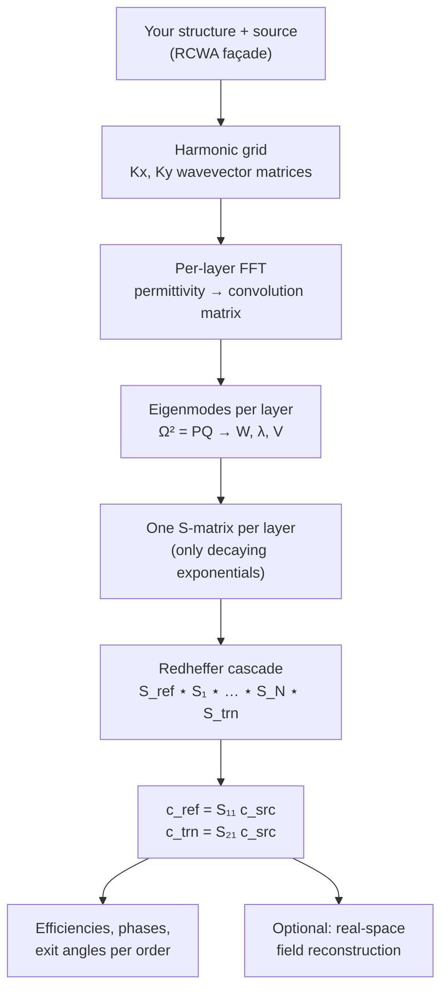

# How RCWA Works

*Or: the biography of a photon entering a periodic obstacle course.*

This chapter explains rigorous coupled-wave analysis (RCWA, also known as the
**Fourier Modal Method**) the way we wish someone had explained it to us:
intuition first, machinery second, full mathematics on demand. Nothing here is
hand-wavy in the end — every analogy is backed by the exact equations Ikarus
implements, and the conventions are stated precisely so you can audit the code.

## RCWA in one breath

> Take a structure that repeats in \(x\) and \(y\) and is built from flat slabs
> in \(z\). Describe the light in each slab as a sum of a few hundred plane
> waves (Fourier harmonics). Inside each slab, find the field patterns that
> travel without changing shape (eigenmodes). Then do impeccable bookkeeping on
> how those modes bounce and transmit at every interface (scattering matrices).
> That's it. That's the whole method.

No mesh. No time stepping. The field is handled *analytically* in \(z\) and
*spectrally* in \((x, y)\) — which is why RCWA wins so decisively for gratings,
metasurfaces and photonic-crystal slabs: those structures are *literally*
stacks of patterned slabs, and the answers you usually want (efficiency per
diffraction order, phase, exit angles) fall out natively.

---

## Part I — The story (no math yet)

### A plane wave meets a periodic world

Picture a perfectly flat wave of light gliding down toward a surface that
repeats every few hundred nanometers — a grating, say. The wave can't ignore
the pattern, but it also can't respond arbitrarily: **periodicity is a
contract**. Whatever the field does, it must repeat (up to a phase twist) with
the same period as the structure. That's Bloch's theorem, and it has a
beautiful consequence:

**The light can only leave in a discrete set of directions.**

Think of them as **exit lanes**. Lane \((0,0)\) is the specular direction —
straight reflection/transmission, the only lane a flat mirror offers. The
pattern opens additional lanes at angles set purely by geometry: the
wavelength-to-period ratio. Each lane is a *diffraction order*, labelled by
integers \((m, n)\), and RCWA's headline output is simply *how much power went
down each lane, and with what phase*.

Some lanes are special: if the geometry asks a lane to leave at "more than 90°",
that order can't propagate — it becomes **evanescent**, a ghost wave that
clings to the surface and decays exponentially. Ghost lanes carry no power to
the far field, but they matter enormously *inside* the structure: near-field
coupling between layers travels through them.

### Every periodic pattern is a sum of smooth waves

How do we describe the patterned material itself? The same way audio engineers
describe a sound: as a **sum of pure tones**. A square pillar, a ring, a
freeform inverse-designed blob — every periodic permittivity profile
\(\varepsilon(x, y)\) is a sum of perfectly smooth spatial waves (Fourier
components). Keep the first \(M\) harmonics in each direction and you have a
controllable approximation: more harmonics, sharper edges, higher cost. The
single number `n_orders` you pass to Ikarus is exactly this truncation.

### Each slab has natural gaits

Inside one uniform-in-\(z\) slab, Maxwell's equations admit special field
patterns that propagate **without changing shape** — only their amplitude and
phase evolve, exponentially, with depth. These are the slab's **eigenmodes**:
its natural gaits. Any field in the slab is a mixture of gaits walking down
plus gaits walking up. Finding them costs one dense eigendecomposition per
patterned layer — *the* computational heart of RCWA.

### The bookkeeping that doesn't melt

Now stack the slabs. At every interface, gaits of one slab convert into gaits
of the next — partially transmitted, partially reflected, with infinite
internal ping-pong between interfaces. Two ways to track this:

- **Transfer matrices** push the field *through* the stack, multiplying layer
  by layer. Elegant — and doomed. They carry growing exponentials
  \(e^{+\lambda z}\) for evanescent modes, which overflow double precision the
  moment a layer is thick or a mode decays fast. *This* is the numerical wax
  melting in mid-flight.
- **Scattering matrices** ask each layer a humbler question: *"if light knocks
  on your door from either side, what comes back and what goes through?"*
  Every entry involves only **decaying** exponentials \(e^{-\lambda L}\) —
  bounded by 1, always. Layers combine via the **Redheffer star product**,
  which resums the infinite interface ping-pong exactly (it's a geometric
  series in disguise).

Ikarus uses scattering matrices exclusively. Thick layers, deeply evanescent
modes, lossy metals — the cascade is unconditionally stable. The wax stays
cool at any altitude.

!!! example "Myth break"
    Ikaros fell because his propagation scheme carried a growing exponential
    (altitude) past its stability limit (wax melting point). A scattering
    formulation — gliding, bounded, never amplifying — would have gotten him
    across the Aegean. Be like the S-matrix.

### The flight plan

---

## Part II — The machinery

Now the same story with its equations. Skim the prose, expand the boxes when
you want the full derivation-grade detail.

### Harmonics and wavevectors

A field periodic with periods \((\Lambda_x, \Lambda_y)\) under Bloch
illumination expands as (Ikarus's sign convention, from
[`ikarus.core.fourier`](api/low-level.md)):

\[
f(x, y) = \sum_{m, n} f_{mn}\,
\exp\!\left[\, i\left(\tfrac{2\pi m}{\Lambda_x}\right) x
              + i\left(\tfrac{2\pi n}{\Lambda_y}\right) y \,\right].
\]

Truncating to \(|m| \le M_x\), \(|n| \le M_y\) keeps

\[
P = (2 M_x + 1)(2 M_y + 1)
\]

harmonics — the size of everything that follows. The incident wave fixes the
in-plane wavevector \((k_{x0}, k_{y0})\); each harmonic carries a shifted copy
(normalized by \(k_0 = 2\pi/\lambda\)):

\[
\tilde{k}_{x,m} = \tilde{k}_{x0} - m\,\frac{\lambda}{\Lambda_x},
\qquad
\tilde{k}_{y,n} = \tilde{k}_{y0} - n\,\frac{\lambda}{\Lambda_y},
\]

collected into diagonal matrices \(\mathbf{K}_x, \mathbf{K}_y\). In a medium of
index \(n_r\), order \((m,n)\) propagates with

\[
\tilde{k}_{z,mn} = \sqrt{\,n_r^2 - \tilde{k}_{x,m}^2 - \tilde{k}_{y,n}^2\,}
\]

— real argument positive: a real exit lane; negative: an evanescent ghost.
For a 1-D grating this is the familiar grating equation,
\(n_i \sin\theta_i + m\lambda/\Lambda = n_t \sin\theta_{t,m}\).

Multiplication by a periodic function becomes, in the truncated basis, a
matrix–vector product with a **convolution (Toeplitz) matrix**
\(\llbracket f \rrbracket_{(m,n),(m',n')} = f_{m-m',\,n-n'}\), built by FFT of
the real-space cell (`convolution_matrix`). This is how the geometry enters
the algebra.

### The eigenproblem: finding the gaits

Within one slab, eliminating the longitudinal field components leaves a
second-order ODE for the tangential Fourier amplitudes
\(\mathbf{s} = [\mathbf{s}_x; \mathbf{s}_y]\) in the stretched coordinate
\(z' = k_0 z\):

\[
\frac{\partial^2 \mathbf{s}}{\partial z'^2}
= \boldsymbol{\Omega}^2\, \mathbf{s},
\qquad
\boldsymbol{\Omega}^2 = \mathbf{P}\,\mathbf{Q}.
\]

??? abstract "Show me P and Q in full"

    For isotropic media the \(2P \times 2P\) blocks are built from the
    permittivity convolution matrix \(\llbracket \varepsilon \rrbracket\) and
    the wavevector matrices:

    \[
    \mathbf{P} =
    \begin{bmatrix}
    \mathbf{K}_x \llbracket \varepsilon \rrbracket^{-1} \mathbf{K}_y &
    \mathbf{I} - \mathbf{K}_x \llbracket \varepsilon \rrbracket^{-1} \mathbf{K}_x \\[4pt]
    \mathbf{K}_y \llbracket \varepsilon \rrbracket^{-1} \mathbf{K}_y - \mathbf{I} &
    -\mathbf{K}_y \llbracket \varepsilon \rrbracket^{-1} \mathbf{K}_x
    \end{bmatrix},
    \quad
    \mathbf{Q} =
    \begin{bmatrix}
    \mathbf{K}_x \mathbf{K}_y &
    \llbracket \varepsilon \rrbracket - \mathbf{K}_x^2 \\[4pt]
    \mathbf{K}_y^2 - \llbracket \varepsilon \rrbracket &
    -\mathbf{K}_y \mathbf{K}_x
    \end{bmatrix}.
    \]

Diagonalizing \(\boldsymbol{\Omega}^2\) yields the slab's modes:

\[
\boldsymbol{\Omega}^2 = \mathbf{W}\,\boldsymbol{\lambda}^2\,\mathbf{W}^{-1},
\qquad
\mathbf{V} = \mathbf{Q}\,\mathbf{W}\,\boldsymbol{\lambda}^{-1},
\]

where \(\mathbf{W}\) holds the **electric** tangential mode profiles,
\(\mathbf{V}\) the **magnetic** ones, and \(\boldsymbol{\lambda}\) the modal
decay/propagation constants — each mode evolves as \(e^{-\lambda z'}\) going
down or \(e^{+\lambda z'}\) going up. For a **homogeneous** slab the
eigenproblem is free: \(\mathbf{W} = \mathbf{I}\) and every block of
\(\mathbf{Q}\) is diagonal, which Ikarus exploits for the cover, substrate and
the reference "gap" medium (`uniform_modes`). That's why thin films cost
nothing and patterned layers cost one eigensolve each.

!!! note "Li's inverse rule (the in-plane \(\llbracket\varepsilon\rrbracket\) in \(\mathbf{Q}\))"
    Writing the \(\mathbf{Q}\) above with the plain \(\llbracket\varepsilon\rrbracket\)
    is **Laurent's (direct) rule**, and it is the *wrong* factorization for the
    E-component that jumps across a boundary: there \(\varepsilon\) and \(E_\perp\)
    both jump while \(D_\perp=\varepsilon E_\perp\) stays continuous, so the product
    must be factorized with the **inverse rule** \(\llbracket 1/\varepsilon
    \rrbracket^{-1}\) (Li, *JOSA A* **13**, 1870 (1996)). Using the direct rule
    instead leaves an \(\mathcal{O}(1/M)\) Gibbs error that cripples TM /
    high-contrast convergence. Li's two-step (separable) operator (*JOSA A* **14**,
    2758 (1997)) — \(\llbracket 1/\varepsilon\rrbracket^{-1}\) along the normal axis,
    direct rule along the tangential one (`_mixed_convolution`) — fixes this
    *exactly* for axis-aligned boundaries (`factorization="li"`). The longitudinal
    \(\llbracket\varepsilon\rrbracket^{-1}\) in \(\mathbf{P}\) is already
    inverse-rule-correct and is unchanged.

!!! tip "The normal-vector method (the default, `factorization="auto"`)"
    Li's two-step rule splits the inverse rule along the fixed *x* and *y* axes,
    which is only correct when boundaries run along those axes. A **curved or
    oblique** boundary has its discontinuity along the *local* normal, so the
    separable rule mis-factorizes it — leaving a residual error that no amount of
    \(n_\text{orders}\) removes (e.g. a high-index ring can sit ~2 % off the true
    reflectance). The **normal-vector method** (Fast Fourier Factorization;
    Schuster *et al.*, *JOSA A* **24**, 2880 (2007); Liu & Fan, *JOSA A* **29**,
    2350 (2012)) builds a smooth unit vector field that follows the true boundary
    normal everywhere and applies the inverse rule *along that direction*, giving
    the full in-plane permittivity **tensor** (with off-diagonal terms) in
    \(\mathbf{Q}\). Ikarus constructs the tangent field by double-angle orientation
    diffusion and assembles the tensor in `_normalvector.py`; on axis-aligned
    geometry the field is constant and it collapses **exactly** back to `"li"`.
    This is the default, validated against FMMax's `Formulation.NORMAL` to
    \(\le 2\times10^{-3}\) on cylinders, rings, ellipses and rotated shapes.
    For **anisotropic** patterned layers the same idea is applied via the rotated
    form of Liu & Fan eq. 45: the in-plane tensor is rotated pointwise into local
    (tangent, normal) coordinates, factorized there (inverse rule on the
    normal-normal entry, Laurent elsewhere), and rotated back in Fourier space. One
    caveat: the tensor formulation is not strictly energy-conserving at *finite*
    order, so `energy_balance` shows a small deviation that shrinks to 0 with
    convergence — a more honest signal than the separable rule, which can report
    perfect energy balance while still biased on a curved boundary.

### Scattering matrices and the star product

A scattering matrix relates *incoming* mode amplitudes on both sides of a block
to *outgoing* ones:

\[
\begin{bmatrix} \mathbf{c}^{-}_{\text{left}} \\ \mathbf{c}^{+}_{\text{right}} \end{bmatrix}
=
\begin{bmatrix} \mathbf{S}_{11} & \mathbf{S}_{12} \\ \mathbf{S}_{21} & \mathbf{S}_{22} \end{bmatrix}
\begin{bmatrix} \mathbf{c}^{+}_{\text{left}} \\ \mathbf{c}^{-}_{\text{right}} \end{bmatrix}.
\]

??? abstract "Show me the single-layer S-matrix"

    Referencing each layer to a common gap medium, with

    \[
    \mathbf{A} = \mathbf{W}^{-1}\mathbf{W}_0 + \mathbf{V}^{-1}\mathbf{V}_0,
    \quad
    \mathbf{B} = \mathbf{W}^{-1}\mathbf{W}_0 - \mathbf{V}^{-1}\mathbf{V}_0,
    \quad
    \mathbf{X} = e^{-\boldsymbol{\lambda}\, k_0 L},
    \]

    the layer blocks follow the standard Rumpf expressions. The crucial
    property: \(\mathbf{X}\) only ever appears with the **negative** exponent —
    every entry is bounded, no matter how thick \(L\) or how evanescent
    \(\lambda\).

Adjacent blocks combine with the **Redheffer star product** (`redheffer_star`):

\[
\mathbf{S}^{AB} = \mathbf{S}^{A} \star \mathbf{S}^{B},
\]

whose \((\mathbf{I} - \mathbf{S}^B_{11}\mathbf{S}^A_{22})^{-1}\)-type factors
are exactly the resummed geometric series of inter-layer reflections — the
infinite ping-pong, settled in closed form. Ikarus evaluates these with
`scipy.linalg.solve` (right-division), so **no explicit matrix inverse is ever
formed** in the hot path. Cascading reflection region, layers and transmission
region gives the global S-matrix, and then

\[
\mathbf{c}_{\text{ref}} = \mathbf{S}_{11}\,\mathbf{c}_{\text{src}},
\qquad
\mathbf{c}_{\text{trn}} = \mathbf{S}_{21}\,\mathbf{c}_{\text{src}}.
\]

### From amplitudes to answers

The power down exit lane \((m,n)\) is its longitudinal Poynting flux relative
to the incident wave:

\[
R_{mn} = \mathrm{Re}\!\left(\frac{\tilde{k}_{z,mn}^{\text{ref}}}{\tilde{k}_{z0}^{\text{inc}}}\right)
\left(|r_{x,mn}|^2 + |r_{y,mn}|^2 + |r_{z,mn}|^2\right),
\]

analogously for \(T_{mn}\). The totals obey
\(R_{\text{total}} + T_{\text{total}} = 1\) for a lossless stack — Ikarus
treats the defect \(|R+T-1|\) as a built-in lie detector for convergence and
sign errors, and warns you automatically when the books don't balance.

---

## Part III — The fine print

### Polarization conventions { #polarization-conventions }

Ikarus uses the physics **\(\exp(-i\omega t)\)** time convention throughout its
public API. The incident direction is set by polar angle \(\theta\) (from
\(+z\)) and azimuth \(\phi\) (from \(+x\)); the transverse basis is

- \(\hat{\mathbf{a}}_{\text{TE}} = \hat{\mathbf{z}} \times \hat{\mathbf{k}}\) (s-polarization),
- \(\hat{\mathbf{a}}_{\text{TM}} = \hat{\mathbf{a}}_{\text{TE}} \times \hat{\mathbf{k}}\) (p-polarization).

| You ask for | You get |
|---|---|
| `linear`, `linear_pol_angle = ψ` | \(\cos\psi\,\hat{\mathbf{a}}_{\text{TE}} + \sin\psi\,\hat{\mathbf{a}}_{\text{TM}}\) — `0` = TE/s, `90` = TM/p |
| `RCP` | \((\hat{\mathbf{a}}_{\text{TE}} + i\,\hat{\mathbf{a}}_{\text{TM}})/\sqrt{2}\) |
| `LCP` | \((\hat{\mathbf{a}}_{\text{TE}} - i\,\hat{\mathbf{a}}_{\text{TM}})/\sqrt{2}\) |

At **normal incidence** TE/TM is degenerate, so Ikarus pins
\(\hat{\mathbf{a}}_{\text{TE}} = +\hat{\mathbf{y}}\) and
\(\hat{\mathbf{a}}_{\text{TM}} = +\hat{\mathbf{x}}\) — `linear_pol_angle`
becomes the literal E-field angle in the xy-plane. For circular light, the
zero order is reported as a **co/cross** handedness decomposition normalized so
\(|c_{\text{co}}|^2 + |c_{\text{cross}}|^2\) equals the order's efficiency.

!!! warning "Comparing phase against another tool?"
    Conventions differ between codes (time sign, reference plane). Expect a
    possible sign flip and/or constant offset; compare the *dispersion* —
    the shape of phase vs. wavelength — not absolute values. In our grcwa
    cross-check the offset was a constant \(\approx -\pi\) and the dispersion
    agreed to ~21 mrad.

### Material models

A material is its complex permittivity
\(\varepsilon(\lambda) = (n + ik)^2\). Under \(\exp(-i\omega t)\), absorbers
have \(k > 0\), \(\mathrm{Im}(\varepsilon) > 0\) — feed Ikarus gain-signed data
and the energy balance will politely exceed 1 to tell you. Three model types
(full API: [Layers & Materials](api/materials-layers.md)):

- **Tabulated** \(n(\lambda), k(\lambda)\) — cubic-spline interpolated (linear
  below 4 points), extrapolated by **clamping** to the nearest endpoint.
- **Lorentz oscillators**:
  \(\varepsilon(\omega) = \varepsilon_\infty
  + \sum_j f_j\,\omega_{0j}^2 / (\omega_{0j}^2 - \omega^2 - i\gamma_j\omega)\).
- **Constant index** — any bare number you pass as a material.

### How many harmonics is enough?

The truncation \(M\) is the accuracy/cost dial, and the cost is steep: the
eigensolve scales as \(\mathcal{O}(P^3)\). The convergence folklore, which
Ikarus's own validation reproduces:

- **TE and gentle structures**: fast convergence, \(M \sim 8\!-\!12\) often suffices.
- **TM, high contrast, metals**: historically slow — the normal \(D\)-field is
  discontinuous at boundaries and a directly-factorized series rings (Gibbs). The
  default [normal-vector factorization](api/rcwa.md#factorization) removes that error along the
  true local boundary normal, so these now converge at \(M \sim 8\!-\!15\) instead
  of \(30+\) — including on **curved/oblique** boundaries where the older separable
  rule stays biased. Pass `factorization="laurent"` to see the old slow behaviour.
- Always watch \(|R+T-1|\) (lossless cases) **and** that \(R\)/phase have stopped
  moving — energy can balance while an unconverged result still drifts. Use the
  [convergence tools](api/tools.md) or `simulate(auto_converge="once")`.

### Branch selection and stability { #branch-selection-and-stability }

A war story worth knowing. For a lossless evanescent order, the modal
eigenvalue argument is **real and negative**, and a naive square root can land
on the wrong Riemann branch — silently flipping the sign of evanescent
magnetic-mode columns. The cruelty: the bug is *invisible* for thin films
(only the zero order propagates) and *catastrophic* for every diffraction
grating. Ikarus selects the forward/decaying branch with one consistent rule
across the gap medium, the semi-infinite regions and all patterned layers
(`_forward_branch`, `uniform_modes`), and adds a vanishing imaginary loss to
regularize orders sitting *exactly* on a Rayleigh–Wood anomaly (the light
line). Both fixes are locked in by the validation suite.

### Limitations of RCWA { #limitations-of-rcwa }

Honesty corner. RCWA is exact as \(M \to \infty\) for layered periodic media,
but the practical method — and this implementation — has edges:

| Limitation | What it means for you |
|---|---|
| **Staircase approximation** | Curved/slanted sidewalls are pixelated; approximate slopes by slicing into several thin layers. |
| **Curved-boundary factorization** | Handled: the default *normal-vector* method (Fast Fourier Factorization) applies the inverse rule along the true local boundary normal, so curved/oblique high-contrast in-plane boundaries converge correctly (validated against FMMax). It is not strictly energy-conserving at finite order — a small `energy_balance` deviation that vanishes with `n_orders`. |
| **Anisotropy: in-plane + z only** | Birefringent media are supported as `[[eps_xx, eps_xy, 0], [eps_yx, eps_yy, 0], [0, 0, eps_zz]]` — any in-plane optic axis plus a distinct z response (wave plates, c-plates, patterned birefringence). *Tilted*-optic-axis media (`eps_xz`/`eps_yz`) and magneto-optic gyrotropy are not supported; the cover and substrate must be isotropic. |
| **Strict periodicity** | Isolated objects need a padded supercell. |
| **One frequency per solve** | Broadband = sweep wavelengths. No time-domain output. |
| **CPU only** | No GPU backend; see [Need for Speed](performance.md) for what to do instead. |

### Further reading

The canonical papers behind the method are collected in
[Citation → Background references](citation.md#background-references) —
Moharam & Gaylord's original formulation, Li's factorization and S-matrix
recursion analyses, and Rumpf's convention-consistent scattering-matrix
formulation, which Ikarus follows.

*Machinery understood. Now go bend some light:*
[Flight School →](tutorials/index.md)
