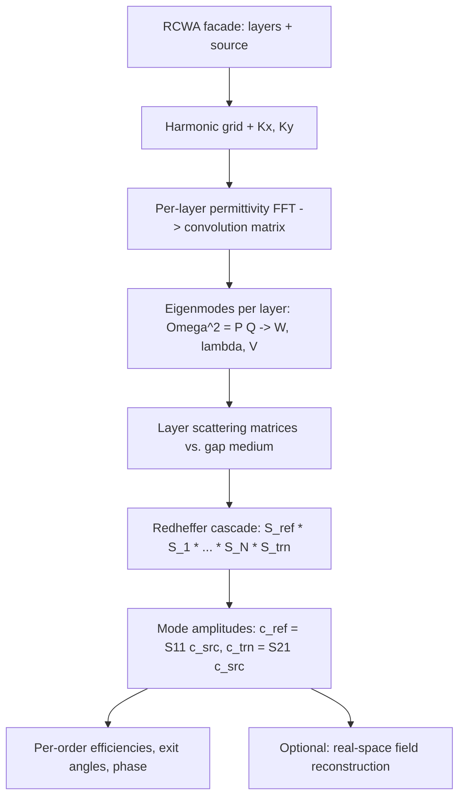

# Theory

This chapter summarizes the rigorous coupled-wave analysis (RCWA) formulation that
Ikarus implements. It is intended to make the conventions explicit and the code
auditable, not to replace a textbook. For the canonical references see
[Citation → Background](citation.md#background-references).

## Introduction to RCWA

Rigorous coupled-wave analysis — equivalently the **Fourier Modal Method (FMM)**
— solves Maxwell's equations for a structure that is **periodic in the two
transverse directions** \((x, y)\) and **piecewise-uniform along the propagation
direction** \(z\). It is *semi-analytic*: the field is treated analytically in
\(z\) (as a sum of exponential layer modes) and spectrally in \((x, y)\) (as a
truncated Fourier series). There is no time stepping and no volumetric mesh; the
cost is concentrated in dense linear algebra over the Fourier harmonics.

The method is the tool of choice for **gratings, metasurfaces and photonic-crystal
slabs**, where the structure is naturally a stack of patterned layers and one
wants order-resolved diffraction efficiencies, complex reflection/transmission
coefficients and phase.

## Fourier Modal Method fundamentals

A field periodic with periods \((\Lambda_x, \Lambda_y)\) under Bloch illumination
is expanded in a **Floquet–Fourier series**. Ikarus uses the expansion convention
(see [`ikarus.core.fourier`](api/low-level.md)):

\[
f(x, y) = \sum_{m, n} f_{mn}\,
\exp\!\left[\, i\left(\tfrac{2\pi m}{\Lambda_x}\right) x
              + i\left(\tfrac{2\pi n}{\Lambda_y}\right) y \,\right].
\]

The harmonic orders are truncated to \(-M_x \le m \le M_x\) and
\(-M_y \le n \le M_y\), giving

\[
P = (2 M_x + 1)(2 M_y + 1)
\]

retained harmonics. Multiplying two periodic functions becomes, in this truncated
basis, a matrix–vector product with a **convolution (Toeplitz) matrix**
\(\llbracket f \rrbracket\) whose entries are \(\llbracket f \rrbracket_{(m,n),(m',n')} = f_{m-m',\,n-n'}\). Ikarus
builds these by FFT of the real-space cell (`convolution_matrix`).

### Bloch wavevectors and diffraction orders

The incident plane wave fixes the in-plane wavevector \((k_{x0}, k_{y0})\). By
Bloch's theorem each harmonic carries a shifted transverse wavevector. In units
normalized by the vacuum wavenumber \(k_0 = 2\pi/\lambda\):

\[
\tilde{k}_{x,m} = \tilde{k}_{x0} - m\,\frac{\lambda}{\Lambda_x},
\qquad
\tilde{k}_{y,n} = \tilde{k}_{y0} - n\,\frac{\lambda}{\Lambda_y},
\]

collected into the **diagonal matrices** \(\mathbf{K}_x, \mathbf{K}_y\). In a
medium of index \(n_r\) the longitudinal wavevector of order \((m,n)\) is

\[
\tilde{k}_{z,mn} = \sqrt{\,n_r^2 - \tilde{k}_{x,m}^2 - \tilde{k}_{y,n}^2\,},
\]

with the branch chosen so the mode either propagates outward or decays into the
region (see [Branch selection](#branch-selection-and-stability)). An order
**propagates** when the argument is positive; otherwise it is **evanescent**. For
a 1-D grating this reduces to the familiar grating equation,

\[
n_i \sin\theta_i + m\,\frac{\lambda}{\Lambda} = n_t \sin\theta_{t,m}.
\]

## Mathematical formulation

Within a uniform-in-\(z\) layer, eliminating the longitudinal field components
from Maxwell's equations yields a second-order ODE for the **tangential** field
Fourier amplitudes \(\mathbf{s} = [\mathbf{s}_x; \mathbf{s}_y]\) in the stretched
coordinate \(z' = k_0 z\):

\[
\frac{\partial^2 \mathbf{s}}{\partial z'^2}
= \boldsymbol{\Omega}^2\, \mathbf{s},
\qquad
\boldsymbol{\Omega}^2 = \mathbf{P}\,\mathbf{Q}.
\]

For isotropic media the \(2P \times 2P\) block operators are built from the
permittivity convolution matrix \(\llbracket \varepsilon \rrbracket\) and the
wavevector matrices:

\[
\mathbf{P} =
\begin{bmatrix}
\mathbf{K}_x \llbracket \varepsilon \rrbracket^{-1} \mathbf{K}_y &
\mathbf{I} - \mathbf{K}_x \llbracket \varepsilon \rrbracket^{-1} \mathbf{K}_x \\[4pt]
\mathbf{K}_y \llbracket \varepsilon \rrbracket^{-1} \mathbf{K}_y - \mathbf{I} &
-\mathbf{K}_y \llbracket \varepsilon \rrbracket^{-1} \mathbf{K}_x
\end{bmatrix},
\quad
\mathbf{Q} =
\begin{bmatrix}
\mathbf{K}_x \mathbf{K}_y &
\llbracket \varepsilon \rrbracket - \mathbf{K}_x^2 \\[4pt]
\mathbf{K}_y^2 - \llbracket \varepsilon \rrbracket &
-\mathbf{K}_y \mathbf{K}_x
\end{bmatrix}.
\]

The **eigendecomposition** of \(\boldsymbol{\Omega}^2\) gives the layer modes:

\[
\boldsymbol{\Omega}^2 = \mathbf{W}\,\boldsymbol{\lambda}^2\,\mathbf{W}^{-1},
\qquad
\mathbf{V} = \mathbf{Q}\,\mathbf{W}\,\boldsymbol{\lambda}^{-1},
\]

where \(\mathbf{W}\) holds the **electric** tangential modal fields,
\(\mathbf{V}\) the **magnetic** ones, and \(\boldsymbol{\lambda}\) the modal decay
constants. A mode propagates as \(\exp(-\lambda z')\) (forward) or
\(\exp(+\lambda z')\) (backward). For a **homogeneous** layer \(\mathbf{W} =
\mathbf{I}\) and every block of \(\mathbf{Q}\) is diagonal, which Ikarus exploits
for the cover, substrate and reference gap (`uniform_modes`).

### S-matrix formalism

Rather than multiplying transfer matrices — which overflow for thick or
evanescent layers because they mix growing and decaying exponentials — Ikarus
assembles a **scattering matrix** per layer, referenced to a common free-space
*gap medium*, and cascades them. A scattering matrix relates the incoming mode
amplitudes on both sides of a block to the outgoing ones:

\[
\begin{bmatrix} \mathbf{c}^{-}_{\text{left}} \\ \mathbf{c}^{+}_{\text{right}} \end{bmatrix}
=
\begin{bmatrix} \mathbf{S}_{11} & \mathbf{S}_{12} \\ \mathbf{S}_{21} & \mathbf{S}_{22} \end{bmatrix}
\begin{bmatrix} \mathbf{c}^{+}_{\text{left}} \\ \mathbf{c}^{-}_{\text{right}} \end{bmatrix}.
\]

Because every block carries only *bounded* exponentials \(\exp(-\lambda k_0 L)\),
the formulation is **unconditionally stable**. For a single layer of thickness
\(L\) between gap regions, with

\[
\mathbf{A} = \mathbf{W}^{-1}\mathbf{W}_0 + \mathbf{V}^{-1}\mathbf{V}_0,
\quad
\mathbf{B} = \mathbf{W}^{-1}\mathbf{W}_0 - \mathbf{V}^{-1}\mathbf{V}_0,
\quad
\mathbf{X} = \exp(-\boldsymbol{\lambda}\, k_0 L),
\]

the layer scattering blocks follow from the standard Rumpf expressions. Adjacent
blocks are combined with the **Redheffer star product** \(\star\)
(`redheffer_star`):

\[
\mathbf{S}^{AB} = \mathbf{S}^{A} \star \mathbf{S}^{B},
\]

which Ikarus evaluates with `scipy.linalg.solve` so that **no explicit matrix
inverse is ever formed**. Cascading the reflection-side region, all interior
layers and the transmission-side region produces the **global** scattering matrix.
The reflected and transmitted mode amplitudes are then

\[
\mathbf{c}_{\text{ref}} = \mathbf{S}_{11}\,\mathbf{c}_{\text{src}},
\qquad
\mathbf{c}_{\text{trn}} = \mathbf{S}_{21}\,\mathbf{c}_{\text{src}}.
\]

### Diffraction efficiencies

The power diffracted into order \((m,n)\) is the ratio of its longitudinal
Poynting flux to that of the incident wave. With the field components recovered
from \(\mathbf{c}_{\text{ref/trn}}\), the per-order efficiencies are

\[
R_{mn} = \mathrm{Re}\!\left(\frac{\tilde{k}_{z,mn}^{\text{ref}}}{\tilde{k}_{z0}^{\text{inc}}}\right)
\left(|r_{x,mn}|^2 + |r_{y,mn}|^2 + |r_{z,mn}|^2\right),
\]

and analogously for \(T_{mn}\) with the substrate \(\tilde{k}_z\). The totals
\(R_{\text{total}} = \sum_{mn} R_{mn}\) and \(T_{\text{total}}\) satisfy
\(R_{\text{total}} + T_{\text{total}} = 1\) for a lossless stack — Ikarus uses the
defect \(|R+T-1|\) as a convergence and sanity metric.

### Solve pipeline

## Polarization conventions

Ikarus uses the physics **\(\exp(-i\omega t)\)** time convention. The incident
direction is set by the polar angle \(\theta\) (from \(+z\)) and azimuth \(\phi\)
(from \(+x\)). The transverse polarization basis is

- \(\hat{\mathbf{a}}_{\text{TE}} = \hat{\mathbf{z}} \times \hat{\mathbf{k}}\) (s-polarization),
- \(\hat{\mathbf{a}}_{\text{TM}} = \hat{\mathbf{a}}_{\text{TE}} \times \hat{\mathbf{k}}\) (p-polarization).

| Polarization | Field |
|---|---|
| `linear`, `linear_pol_angle = ψ` | \(\cos\psi\,\hat{\mathbf{a}}_{\text{TE}} + \sin\psi\,\hat{\mathbf{a}}_{\text{TM}}\) — so `0` = TE/s, `90` = TM/p |
| `RCP` | \((\hat{\mathbf{a}}_{\text{TE}} + i\,\hat{\mathbf{a}}_{\text{TM}})/\sqrt{2}\) |
| `LCP` | \((\hat{\mathbf{a}}_{\text{TE}} - i\,\hat{\mathbf{a}}_{\text{TM}})/\sqrt{2}\) |

At **normal incidence** the TE/TM split is degenerate, so Ikarus fixes
\(\hat{\mathbf{a}}_{\text{TE}} = +\hat{\mathbf{y}}\) and
\(\hat{\mathbf{a}}_{\text{TM}} = +\hat{\mathbf{x}}\); then `linear_pol_angle`
becomes the physical E-field angle in the xy-plane. For circular illumination the
zero order is reported as a **co/cross** decomposition (same vs. opposite
handedness), normalized so that \(|c_{\text{co}}|^2 + |c_{\text{cross}}|^2\) equals
the order efficiency.

## Material models

A material returns a complex relative permittivity
\(\varepsilon(\lambda) = (n + i k)^2\). Under \(\exp(-i\omega t)\) an **absorbing**
medium has \(k > 0\) and \(\mathrm{Im}(\varepsilon) > 0\). Three model types are
supported (see [Layers & Materials](api/materials-layers.md)):

- **Tabulated** \(n(\lambda), k(\lambda)\) — interpolated with a cubic spline
  (linear if fewer than four points), extrapolated by clamping to the nearest
  endpoint.
- **Lorentz oscillator model**:

  \[
  \varepsilon(\omega) = \varepsilon_\infty
  + \sum_j \frac{f_j\,\omega_{0j}^2}{\omega_{0j}^2 - \omega^2 - i\,\gamma_j\,\omega}.
  \]

- **Constant index** — a non-dispersive complex number, convenient for tests.

## Numerical convergence considerations

The single most important numerical parameter is the harmonic truncation
\(n\_orders = M\).

- The eigensolve is \(\mathcal{O}(P^3)\) with \(P = (2M_x+1)(2M_y+1)\), so cost
  grows steeply with \(M\) (see [Performance](performance.md)).
- **TE** (s-pol) and low-contrast structures converge quickly. **TM** (p-pol),
  high-index-contrast and metallic structures converge slowly because of the
  discontinuity of the normal \(D\)-field at material boundaries (a Gibbs
  phenomenon in the Fourier representation).
- The real-space `resolution` must resolve the geometry **and** be fine enough for
  the convolution matrix — Ikarus automatically raises it to at least
  \(4M+1\) samples per axis to avoid aliasing the required difference orders.
- Use [`auto_converge`](api/tools.md) or a manual
  [convergence sweep](tutorials/parameter-sweeps.md#convergence-study) to choose
  \(M\), and watch \(|R+T-1|\) for lossless cases.

### Branch selection and stability

For a lossless evanescent order the modal eigenvalue argument is real and
*negative*. A naive per-order square root can land on the wrong Riemann branch and
silently flip the sign of the evanescent magnetic-mode columns — invisible when
only the zero order propagates (Fresnel slabs) but corrupting for **every
diffraction grating**. Ikarus selects the **forward/decaying branch** consistently
across the gap, the semi-infinite regions and patterned layers (`_forward_branch`,
`uniform_modes`), and adds a tiny imaginary loss to regularize orders that sit
exactly on a Rayleigh–Wood anomaly (the light line).

## Limitations of RCWA

RCWA is exact in the limit \(M \to \infty\) for layered periodic media, but the
practical method (and this implementation) has boundaries:

- **Staircase approximation.** Curved or slanted features are represented on a
  pixel grid; sloped sidewalls must be approximated by slicing into several thin
  layers.
- **Slow TM convergence at high contrast.** Ikarus uses **Laurent's rule** (direct
  convolution). The accelerated **Li factorization (inverse rule)** is *not yet
  implemented*, so sharp metallic/high-index TM problems may need a larger \(M\)
  than a Li-rule code.
- **Isotropic media only.** Full \(3\times 3\) anisotropic permittivity tensors
  are *not yet supported*.
- **Periodicity.** Only strictly periodic structures are modelled; isolated or
  finite objects require a supercell with enough padding.
- **Frequency-domain, single wavelength per solve.** Broadband responses are
  obtained by sweeping wavelength; there is no native time-domain output.
- **CPU only.** No GPU backend (see [Performance](performance.md)).

These map directly onto the roadmap items flagged in the [feature
table](index.md#key-features).
