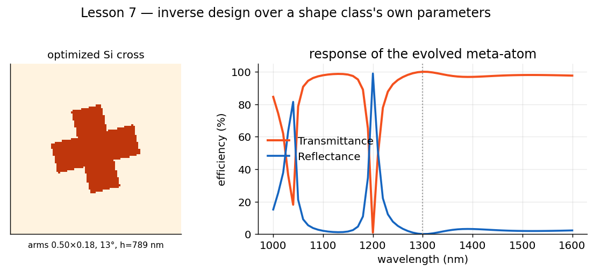
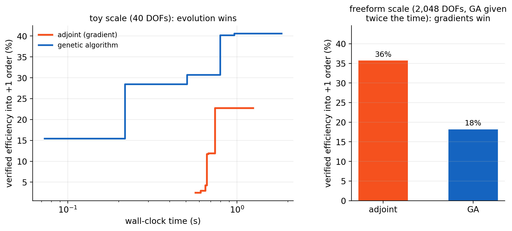

# Lesson 7 · Inverse Design

**Mission:** stop choosing parameters by hand. State a goal — "maximum
transmission at 1300 nm", "reflect 1064 *and* 1550", "show me the trade-off" —
and let the optimizer design the meta-atom for you: named shape parameters,
fully freeform pixel patterns, heights, periods, or several of these at once.

Every previous lesson was **forward** design: you set the geometry, Ikarus told
you the optics. This one runs the arrow backwards — five ways.

## Two ways to hold a degree of freedom

Ikarus's inverse module ([`ikarus.inverse`](../api/inverse.md)) optimizes two
kinds of topology DOF — and `optimize()` **automatically picks the right engine
for each** (you never choose):

| DOF | What it is | Engine `optimize()` picks |
|---|---|---|
| **Parametric shape** | a shape class (`Cross`, `SplitRing`, …) with named, bounded parameters | genetic algorithm — a few interpretable knobs, and rasterization has no gradients |
| **Pixel map** | a free binary grid (`pixels(nx, ny, symmetry=...)`) | **adjoint gradients** — the derivative w.r.t. *every* pixel costs about one extra solve, so freeform scales to thousands of DOFs |

The first half of this lesson is the parametric route — the one your intuition
can read. The second half goes freeform.

!!! note "Extras"
    Parametric/GA route: `pip install "ikarus-rcwa[inverse]"` (pymoo).
    Freeform/adjoint route: `pip install "ikarus-rcwa[grad]"` (JAX).
    `[all]` includes both.

## Parametric shapes

A parametric [`Shape`](../api/shapes.md#parametric-shapes) carries named
parameters and a rotation `angle`. Used normally, it's just a tidy topology:

```python
from ikarus.shapes import Cross
topo = Cross(arm_length=0.7, arm_width=0.2, angle=30).to_grid((128, 128))
```

The trick: **any parameter may be a `free(lo, hi)` range instead of a number.**
Mark a few free, and they become the optimization variables — no pixel grids, no
loss of physical meaning.

```python
from ikarus.inverse import free
from ikarus.shapes import Cross

shape = Cross(arm_length=free(0.3, 0.95),   # free: the GA will choose
              arm_width=free(0.1, 0.45),    # free
              angle=free(0, 90))            # free: rotation is a knob too
shape.free_parameters()
# {'angle': (0.0, 90.0), 'arm_length': (0.3, 0.95), 'arm_width': (0.1, 0.45)}
```

## The three-step recipe

Declare the meta-atom, state the target, optimize:

```python
import os
os.environ.setdefault("OMP_NUM_THREADS", "1")   # single-thread BLAS for the GA loop

from ikarus.inverse import MetaAtom, free, optimize, Target
from ikarus.shapes import Cross

# 1. a Si cross on glass whose arms, rotation and height are all free
atom = MetaAtom(period=700e-9, cover="Air", substrate="SiO2")
atom.add_pattern(topology=Cross(arm_length=free(0.3, 0.95),
                                arm_width=free(0.1, 0.45),
                                angle=free(0, 90), grid_shape=(96, 96)),
                 materials=["Air", "Si"],
                 height=free(0.3e-6, 0.9e-6))

# 2. what we want: maximum transmission at 1300 nm
target = Target.maximize("T", at=1300e-9)

# 3. evolve it
best = optimize(atom, target, n_orders=6, pop=16, n_gen=10, seed=0)
print(best.report())

design = best.metaatom          # a ready-to-simulate RCWA
```

The optimizer enumerates the free shape parameters automatically — they appear in
the report as `shape__arm_length`, `shape__angle`, and so on, alongside the free
`height`:

```text
Inverse-design result:
  objective = 0.016  (max(T))
    height = 7.89e-07
    shape__angle = 12.6
    shape__arm_length = 0.85
    shape__arm_width = 0.40
```

<figure markdown="span">
  { width="760" }
  <figcaption>The genetic algorithm chose the arm dimensions, rotation and height of a Si cross to maximize transmission at 1300&nbsp;nm (dotted line). Left: the evolved topology. Right: its full spectrum, computed by Ikarus.</figcaption>
</figure>

## Plot the result

Visualize the evolved meta-atom and sweep its spectrum:

```python
import numpy as np
import matplotlib.pyplot as plt

design = best.metaatom            # the optimized RCWA (also best.rcwa)

# the evolved topology (the patterned layer is layer 1)
design.visualize_structure(plane="xy", layer_index=1, savefig="evolved_atom.png")

# its transmission spectrum
wl = np.linspace(1.0e-6, 1.6e-6, 31)
T = []
for w in wl:
    design.set_source(wavelength=w, theta=0, polarization="linear")
    T.append(design.simulate()[2].T_total)

plt.figure(figsize=(7, 4))
plt.plot(wl * 1e9, np.array(T) * 100, lw=2)
plt.axvline(1300, color="0.6", ls=":")        # the optimization target
plt.xlabel("wavelength (nm)"); plt.ylabel("transmittance (%)")
plt.title("Spectrum of the evolved meta-atom"); plt.grid(alpha=0.3)
plt.tight_layout(); plt.savefig("evolved_spectrum.png", dpi=150, bbox_inches="tight")
plt.show()
```

## Going freeform: pixels + adjoint gradients

When you have **no** good shape prior, hand the optimizer a blank pixel canvas.
The call is the same — only the topology changes. A beam deflector (steer the
reflected power into the +1 order — a job that *requires* structure; runs in a
few minutes):

```python
from ikarus.inverse import MetaAtom, optimize, pixels, Target

atom = MetaAtom(period=2000e-9, cover="Air", substrate="SiO2")
atom.add_pattern(topology=pixels(64, 64, symmetry="mirror_y"),  # 2,048 DOFs
                 materials=["Air", "aSi"], height=500e-9)

best = optimize(atom, Target.maximize("R", at=1550e-9, order=(1, 0)),
                n_orders=8, min_feature=100e-9,   # fab-ready feature-size limit
                init="random")                    # steering: start from noise
print(best.report())
best.rcwa.visualize_structure(plane="xy")         # the invented topology
```

Because the problem is differentiable, `optimize()` silently switches from the
GA to **adjoint gradients**: each iteration computes the derivative of the
objective with respect to *every pixel at once* for the price of roughly one
extra solve. Pixels are optimized as continuous densities, smoothed by a
minimum-feature filter (`min_feature`, in meters — your fab's design rule),
sharpened toward binary as the run progresses, and the final hard-binarized
design is re-verified with the standard solver, so `best.F` is exactly what
`best.rcwa.simulate()` reproduces.

### When does each engine actually win?

We measured it, honestly — same problems, hard-binarized designs re-verified at
a *higher* truncation than either optimizer used:

<figure markdown="span">
  { width="920" }
  <figcaption><strong>The crossover is the lesson.</strong> Left: a toy 1-D
  deflector (40 pixels) — both engines finish in <em>seconds</em>, and the
  genetic algorithm legitimately wins: a few hundred evaluations can genuinely
  search a space that small. Right: the same physics at freeform scale (2,048
  pixels; the adjoint got ten minutes, the GA got twice that) — the adjoint's
  whole-gradient steps dominate, because the gradient's cost doesn't grow with the pixel count but
  the GA's search space explodes. Small discrete spaces belong to evolution;
  freeform scale belongs to gradients — which is exactly why
  <code>optimize()</code> keeps both engines.</figcaption>
</figure>

## The continuous knobs: heights and periods

Not every design question is a topology question. Layer `height` and the
`period` can be `free(...)` too — and because they are smooth, differentiable
quantities, `optimize()` again uses adjoint gradients. A case with a textbook
answer, so you can watch the optimizer be *exactly* right (runs in seconds):

```python
import numpy as np
from ikarus.inverse import MetaAtom, Target, optimize, free

# a quarter-wave AR candidate: index sqrt(1.5) film on glass, height free
atom = MetaAtom(period=400e-9, cover="Air", substrate=1.5)
atom.add_pattern(topology=np.zeros((4, 4), dtype=int), materials=[1.2247],
                 height=free(60e-9, 200e-9))

best = optimize(atom, Target.minimize("R", at=600e-9), n_orders=1)
print(best.report())
# height -> 122.5 nm  ==  lambda / 4n, the analytic optimum, and R ~ 1e-9
```

## One design, several wavelengths: worst-case targets

"High reflectance at 1064 nm **and** 1550 nm, from the same atom" is *one*
objective — the worst of the two wavelengths — not two separate ones. Say
exactly that with `worst_case=True`, and it stays on the adjoint fast path
(pixels **and** the free height are optimized together; expect a few minutes):

```python
from ikarus.inverse import MetaAtom, Target, optimize, free, pixels

atom = MetaAtom(period=900e-9, cover="Air", substrate="SiO2")
atom.add_pattern(topology=pixels(40, 40, symmetry="c4v"),
                 materials=["Air", "aSi"], height=free(300e-9, 800e-9))

target = Target.maximize("R", at=[1064e-9, 1550e-9], order=None,
                         worst_case=True)          # lift the WORST wavelength
best = optimize(atom, target, n_orders=8, min_feature=80e-9)
print(best.report())
```

Under the hood the adjoint engine uses a smoothed maximum so *both* wavelengths
receive gradient every step (a hard max would starve the currently-better one) —
but the reported objective is the honest hard worst case, re-evaluated with the
standard solver.

## Trade-offs on purpose: Pareto fronts (NSGA-III)

Sometimes you don't want one compromise — you want to *see the whole trade-off*.
Pass **two or more `Target`s** and `optimize()` switches to NSGA-III, which
returns the Pareto front in a single run (this is the one thing gradients cannot
do: one adjoint run yields one point on that front, not the curve):

```python
targets = [Target.maximize("R", at=1064e-9, order=None),
           Target.maximize("R", at=1550e-9, order=None)]
front = optimize(atom, targets, n_orders=6, pop=60, n_gen=40)   # minutes

import numpy as np
F = np.asarray(front.F)                     # one row per Pareto design
for i, f in enumerate(F[:5]):
    print(f"design {i}:  R(1064) = {1-f[0]:.3f}   R(1550) = {1-f[1]:.3f}")

pick = front.X[2]                           # choose your compromise...
rcwa = front.atom.build(pick, n_orders=6)   # ...and simulate it
```

Rule of thumb: `worst_case=True` when you know the balance you want (and want
adjoint speed); separate targets when the balance itself is the question.

## Taking the controls yourself

`algorithm="auto"` is the default and the recommendation — but nothing is
hidden. Force an engine and tune it explicitly:

```python
best = optimize(atom, target, algorithm="adjoint",     # force gradients
                steps=300, learning_rate=0.02,         # longer, gentler
                min_feature=100e-9,                    # your fab's design rule
                beta=(8, 512))                         # binarization ramp

best = optimize(atom, target, algorithm="ga",          # force the GA
                pop=120, n_gen=100)                    # its knobs, as always
```

| Knob | Engine | Meaning |
|---|---|---|
| `steps`, `learning_rate` | adjoint | Adam iterations (~1.5 solves each per wavelength) and step size. |
| `min_feature` (meters) | adjoint | conic-filter radius = half this; keeps pixel designs fabbable *and* smooths the landscape. |
| `beta=(lo, hi)` | adjoint | sharpness ramp pushing densities to binary. |
| `init` | adjoint | pixel start: `"uniform"` (default — reflect/transmit objectives), `"random"` (deflection/steering objectives, whose landscape is flat at uniform gray — run a few `seed`s and keep the best), or a float fill. |
| `pop`, `n_gen` | GA family | population and generations. |
| `seed` | both | reproducible runs. |

If you pass GA knobs to a problem that auto-routes to adjoint, Ikarus warns and
ignores them — pass `algorithm="ga"` if you really meant the GA.

## The engine map

| Your problem | Engine `auto` picks | Why |
|---|---|---|
| Freeform `pixels(...)`, one target | **adjoint** | whole-gradient per solve; scales to thousands of DOFs |
| Free `height` / `period`, one target | **adjoint** | smooth, differentiable |
| One target over several wavelengths (`worst_case` or mean) | **adjoint** | still a single scalar objective |
| Parametric `Shape` DOFs | **GA** | rasterization has no gradients |
| ≥ 2 targets (the trade-off is the question) | **NSGA-III** | a full Pareto front in one run |
| `Structure` stacks, anisotropic materials, circular-pol coefficient targets | **GA** | not yet on the differentiable path |
| `[grad]` extra not installed | **GA** | graceful fallback |

Many real workflows chain the engines: parametric GA to get close and
*understand* the physics, freeform adjoint to squeeze the last percent.

## Bringing your own shape class

`add_layer` and the inverse module accept **any object that exposes an `img`
array** (or a `to_grid()` method), so an external topology library drops straight
in:

```python
# any class with a binary `.img` numpy array works as a topology
rcwa.add_layer(200e-9, MyTopologySpecies(lx=0.4, ly=0.7), ["Air", "Si"])
```

To make a custom shape *optimizable*, subclass
[`ikarus.shapes.Shape`](../api/shapes.md#parametric-shapes): declare its
parameters in `_PARAMS` and implement `_mask`. It then inherits `free_parameters`,
rotation and the inverse-design plumbing for free.

## Expected results

- A converging objective (the GA's `f_min` drops each generation), ending in a
  high-transmission cross with a specific rotation.
- A spectrum with the target wavelength sitting in a transmission window — and,
  often, a sharp resonance nearby that the optimizer steered *away* from the
  target.

## Pilot habits

- **Pin BLAS to one thread** ([why](../performance.md#blas-threading)) — GA loops
  are many small solves.
- Start with **small `pop`/`n_gen`** (GA) or **small `steps`** (adjoint) to gauge
  runtime and sanity, then scale up.
- For pixel maps, set `min_feature` to your fab's design rule from the start —
  it also smooths the optimization landscape.
- **Keep the forward model faithful to your features.** Optimizers exploit
  whatever you give them — on an under-resolved model (`n_orders` too low for
  the pixel size) *any* engine will happily "optimize" numerical artifacts that
  vanish on a converged re-check. Chunky pixels or a `min_feature` matched to
  `n_orders` keep the fitness honest; always re-simulate the final design at
  higher `n_orders` before believing it.
- **Beware trivial attractors.** "Maximize total R" can be satisfied by a boring
  uniform slab — gradients will happily roll into it. Objectives that *require*
  structure (specific orders, phase targets, multi-wavelength) make far better
  use of the optimizer.
- For steering/deflection objectives, use `init="random"` (+ a few `seed`s):
  their landscape is flat at uniform gray.
- **A handful of pixels? The GA is genuinely competitive** (it can nearly
  enumerate small spaces) — the adjoint's edge grows with DOF count. Forcing
  `algorithm="ga"` on a 30-pixel problem is a perfectly good choice.
- Bound parameters **physically** (an `arm_width` can't exceed the period) — tight,
  honest ranges make the search both faster and manufacturable.
- Free the **rotation**: `angle` is a cheap extra knob that unlocks
  polarization-dependent and chiral responses (try `SplitRing`).

---

*Next:* [Lesson 8 · Stacking the Deck →](structures.md) — optimize a whole
multi-layer stack at once.
