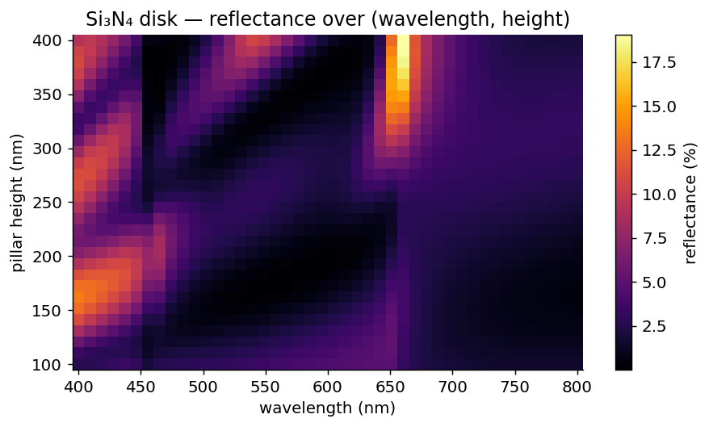

# Lesson 4 · Sweeping Gracefully

**Mission:** sweep parameters without wasting a single eigensolve (or writing a
single for-loop you don't have to), perform the convergence ritual every
trustworthy result rests on, and paint a 2-D design map.

## The easy way: `Sweep`

For **source** sweeps — wavelength, angle, polarization — skip the loop entirely.
[`Sweep`](../api/sweeps.md) varies the source over a grid and hands back arrays,
with **one progress bar** for the whole run (so you can see the ETA):

```python
import numpy as np
from ikarus import RCWA, shapes, Sweep

period, N = 450e-9, 96
disk = shapes.circle(radius=0.3, grid_shape=(N, N))
rcwa = RCWA(period_x=period, period_y=period, resolution=(N, N), n_orders=(9, 9))
rcwa.add_uniform_layer(np.inf, "Air")
rcwa.add_layer(200e-9, disk, ["Air", "Si3N4"])
rcwa.add_uniform_layer(np.inf, "SiO2")
rcwa.set_source(wavelength=600e-9, theta=0, polarization="linear")

res = Sweep(rcwa).over(wavelength=np.linspace(400e-9, 800e-9, 81)).run()
R = res.R_total                       # array aligned to the sweep axis
```

A 2-D grid is the same call with two axes — and still one bar:

```python
res = Sweep(rcwa).over(theta=np.linspace(0, 60, 13),
                       wavelength=np.linspace(400e-9, 800e-9, 41)).run()
res.R_total.shape                     # (13, 41)
res.order(1, 0, which="R")            # +1 reflected order across the grid
```

!!! warning "Mind the solve count"
    A 2-D sweep is `n_theta × n_wavelength` **full solves** — there is no
    eigenmode caching, so each grid point costs a complete solve (~3 s here at
    `n_orders=(9,9)`; see [Need for Speed](../performance.md)). The 13×41 grid
    above is ~530 solves (minutes); a 31×81 grid is ~2,500 (a couple of hours).
    Start coarse, and drop `n_orders`/`resolution` while you explore.

## The manual pattern (and your toggle)

When you need full control — or you're sweeping **geometry** (which rebuilds the
structure) — write the loop, and wrap it in [`progress`](../api/sweeps.md#progress)
for one bar with an on/off switch:

```python
from ikarus import progress

wavelengths = np.linspace(400e-9, 800e-9, 81)
R = np.empty_like(wavelengths)
for i, wl in enumerate(progress(wavelengths, desc="λ", enable=True)):
    rcwa.set_source(wavelength=wl)    # set_source remembers theta & polarization
    R[i] = rcwa.simulate()[2].R_total
```

Reuse **one** `RCWA` and change only the source between solves — it keeps the
geometry fixed and is the correct, convenient pattern. Note it is not a *speed*
win: there is no eigenmode caching yet, so **every** `set_source` re-solve costs
a full solve (wavelength, angle *and* polarization alike). Budget one solve per
sweep point — see the cost table in [Need for Speed](../performance.md).

## The convergence ritual { #convergence-study }

Before you trust a sweep — let alone publish it — confirm the harmonic count is
sufficient. The honest way is to watch the quantity *you actually care about* stop
moving. For most designs that's the zeroth-order **reflectance and its phase** —
**not** the energy balance:

```python
from ikarus.tools.convergence import convergence_curve

rcwa.set_source(wavelength=600e-9)
orders, phase = convergence_curve(rcwa, range(4, 21, 2), metric="R_phase")
for M, p in zip(orders, phase):
    print(f"n_orders={M:3d}: reflected phase = {p:+.2f} deg")
```

(`convergence_curve` politely restores your original `n_orders` afterward; pass
`metric="R"` for reflectance, `"R_phase"`/`"T_phase"` for phase.) Or delegate the
whole ritual — `auto_converge` raises the order count until the complex R/T
coefficients (magnitude *and* phase) settle:

```python
rcwa.simulate(auto_converge="once", verbose=True)   # finds & caches n_orders
print("using n_orders =", rcwa.n_orders)

# one-off solve? ask Ikarus to warn you if it's under-resolved:
T, R, res = rcwa.simulate(check_convergence=True)
```

!!! danger "`R + T ≈ 1` is **not** convergence"
    A lossless structure conserves energy at *every* `n_orders`, even while its
    reflectance and phase are still drifting. Converging on `|R+T−1|` will happily
    declare victory on a wrong answer — this has cost real multi-hour optimization
    runs. Converge on R and **phase**.

!!! warning "Converge at your *worst* point, not your favorite one"
    TM polarization, the highest contrast, the shortest wavelength, the
    steepest resonance — that's where convergence is slowest. A study run at a
    benign wavelength is a false sense of security with extra steps.

## A 2-D design map

Reflectance vs. wavelength *and* pillar height — the kind of plot that finds
designs for you. Height is **structural** (it rebuilds the layer), so it's the
outer loop with a [`progress`](../api/sweeps.md#progress) bar; wavelength is a
source axis, so the inner sweep is a [`Sweep`](../api/sweeps.md):

```python
import numpy as np
from ikarus import RCWA, shapes, Sweep, progress

period, N = 450e-9, 96
disk = shapes.circle(radius=0.3, grid_shape=(N, N))
# A design map is heights × wavelengths FULL solves. This 40×24 ≈ 960 at
# n_orders=(7,7) (~0.4 s each) runs in minutes; the paper-quality 60×40 at
# (9,9) is ~2 h. Coarsen while exploring, refine once.
wavelengths = np.linspace(400e-9, 800e-9, 40)
heights = np.linspace(100e-9, 400e-9, 24)

Rmap = np.empty((heights.size, wavelengths.size))
for j, h in enumerate(progress(heights, desc="height")):
    rcwa = RCWA(period_x=period, period_y=period, resolution=(N, N), n_orders=(7, 7))
    rcwa.add_uniform_layer(np.inf, "Air")
    rcwa.add_layer(h, disk, ["Air", "Si3N4"])
    rcwa.add_uniform_layer(np.inf, "SiO2")
    rcwa.set_source(wavelength=600e-9, theta=0, polarization="linear")
    Rmap[j] = Sweep(rcwa).over(wavelength=wavelengths).run(progress=False).R_total

import matplotlib.pyplot as plt
plt.pcolormesh(wavelengths * 1e9, heights * 1e9, Rmap, shading="auto", cmap="inferno")
plt.xlabel("wavelength (nm)"); plt.ylabel("pillar height (nm)")
plt.colorbar(label="Reflectance"); plt.savefig("Rmap.png", dpi=150)
```

Resonance bands glow; anti-reflection valleys go dark. Design by sightseeing.

<figure markdown="span">
  { width="640" }
  <figcaption>Reflectance of a Si₃N₄ disk over wavelength and pillar height — a 2-D design map built from nested sweeps.</figcaption>
</figure>

## Need it faster?

- **Pin BLAS to one thread** before importing NumPy — for these small matrices,
  threaded BLAS is a traffic jam, not a speedup
  ([the full story](../performance.md#blas-threading)).
- **Fan out across processes** — every solve is independent;
  [Aerobatics → Batch simulations](../advanced.md#batch-simulations) has the
  recipe.

## Expected results

- The reflectance and its **phase** stop moving with `n_orders`; once the change
  per step is below your tolerance (say a few × 10⁻³ in the coefficient, ~0.1° of
  phase), extra harmonics buy nothing but heat. (Energy balances long before that,
  so don't use it as the gauge.)
- The 2-D map shows resonance bands (bright `R`) and broadband AR valleys
  (dark) — the design space at a glance.

---

*Next:* [Lesson 5 · Twisting Light →](polarization.md)
