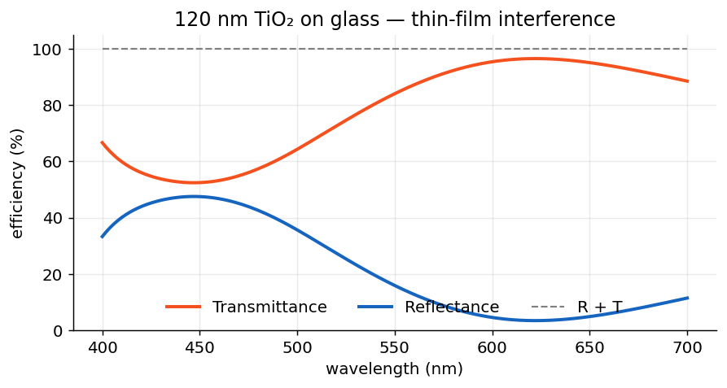

# Lesson 1 · Spectra 101

**Mission:** compute \(R(\lambda)\) and \(T(\lambda)\) for a layered structure,
learn to read the specular order, and meet absorption — the legitimate reason
the books don't always sum to one.

## A thin-film stack

A 120 nm TiO₂ film on glass, swept across the visible. Nothing is patterned,
so only the specular lane exists and RCWA reproduces the exact transfer-matrix
spectrum — at `n_orders=0`, which makes it effectively free:

```python
import numpy as np
from ikarus import RCWA

rcwa = RCWA(period_x=400e-9, period_y=400e-9, n_orders=0)  # specular only
rcwa.add_uniform_layer(np.inf, "Air")
rcwa.add_uniform_layer(120e-9, "TiO2")
rcwa.add_uniform_layer(np.inf, "SiO2")

wavelengths = np.linspace(400e-9, 700e-9, 61)
R, T = [], []
for wl in wavelengths:
    rcwa.set_source(wavelength=wl, theta=0, polarization="linear")
    _, _, res = rcwa.simulate()
    R.append(res.R_total)
    T.append(res.T_total)

R, T = np.array(R), np.array(T)
print(f"R+T spans [{(R+T).min():.6f}, {(R+T).max():.6f}]")  # ≈ 1: lossless here
```

!!! tip "Why `n_orders=0` is not cheating"
    A uniform stack has no pattern to diffract from — one harmonic (the
    specular order) captures the physics *exactly*. Save the big harmonic
    budgets for patterned layers; thin films fly free.

## Plot it

```python
import matplotlib.pyplot as plt

fig, ax = plt.subplots(figsize=(7, 4))
ax.plot(wavelengths * 1e9, R * 100, label="Reflectance")
ax.plot(wavelengths * 1e9, T * 100, label="Transmittance")
ax.plot(wavelengths * 1e9, (R + T) * 100, "k--", lw=1, label="R + T")
ax.set_xlabel("wavelength (nm)")
ax.set_ylabel("efficiency (%)")
ax.legend(); ax.grid(alpha=0.3)
fig.savefig("thin_film_spectrum.png", dpi=150, bbox_inches="tight")
```

<figure markdown="span">
  { width="640" }
  <figcaption>Reflectance, transmittance and their sum for a 120&nbsp;nm TiO₂ film on glass. R&nbsp;+&nbsp;T pins at 100% — TiO₂ is lossless across the visible.</figcaption>
</figure>

## Totals vs. the specular lane

`R_total`/`T_total` sum over **all** propagating orders. For patterned
structures you'll often want just the straight-through lane:

```python
i00 = res.order_index(0, 0)
print("specular T(0,0) =", res.T_orders[i00])
print("specular R(0,0) =", res.R_orders[i00])
```

For this thin film they coincide — there *is* only the one lane.

## Absorption: when R + T honestly isn't 1

Put 50 nm of gold in the path and watch the energy ledger:

```python
rcwa = RCWA(period_x=400e-9, period_y=400e-9, n_orders=0)
rcwa.add_uniform_layer(np.inf, "Air")
rcwa.add_uniform_layer(50e-9, "Au")          # gold: a glutton in the visible
rcwa.add_uniform_layer(np.inf, "SiO2")

rcwa.set_source(wavelength=550e-9, theta=0, polarization="linear")
_, _, res = rcwa.simulate()
A = 1.0 - res.energy_balance
print(f"R={res.R_total:.3f}  T={res.T_total:.3f}  A={A:.3f}")
```

`A` is real ohmic loss, not an error. The diagnostic rule:

| `energy_balance` reads… | Verdict |
|---|---|
| ≈ 1 (lossless materials) | converged, healthy |
| < 1 (lossy materials) | absorption — physics, working as intended |
| ≳ 1.01 (lossless) | **unconverged** — raise `n_orders` |
| ≫ 1 | numerical trouble — see [Troubleshooting](../troubleshooting.md) |

## Expected results

- **TiO₂/glass:** smooth interference fringes; `R+T ≈ 1` to ~10⁻⁹.
- **Au film:** a real `A` (≈0.27 here), `R+T` well below 1 — gold doing gold things.

## Pilot habits

- `n_orders=0` for thin films — exact and instant.
- One `RCWA`, many `set_source(wavelength=...)` calls — never rebuild a fixed
  stack inside a sweep.
- Glance at `energy_balance` after every new structure. It's the cheapest bug
  detector in photonics.

---

*Next:* [Lesson 2 · Splitting Light →](gratings.md)
