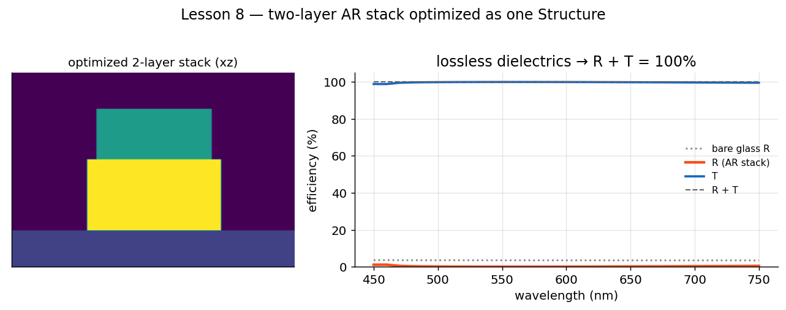
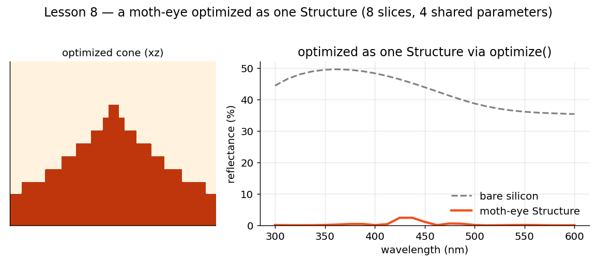

# Lesson 8 · Stacking the Deck

**Mission:** optimize a whole **multi-layer stack** at once — not just a single
meta-atom. You'll meet the [`Structure`](../api/inverse.md#structure) class, build a
two-layer anti-reflection coating with it, plot the result, and then meet the
*shared-parameter* trick that lets a handful of knobs drive a dozen layers.

[Lesson 7](inverse-design.md) optimized one patterned layer. Real devices stack
them — a disk in one layer, a cross in another, or a graded cone sliced into
sub-layers. A `MetaAtom` can't express that. A `Structure` can.

!!! note "Needs pymoo"
    `pip install "ikarus-rcwa[inverse]"`.

## The idea: declare, then `define`

You **subclass** `Structure`, **declare** each parameter as a class attribute
(`free(...)` for a degree of freedom, a plain value for fixed), and implement
**`define(self, p)`** to lay out the layers. Inside `define`, `p` carries the
*resolved* values — the optimizer's picks for the free ones — and you call
`self.add_layer(...)`. The cover, substrate and period are added for you.

## A two-layer AR coating (the runnable example)

A silicon-nitride disk over a TiO₂ disk on glass — **two patterned layers**, with
both radii, both heights and the period free, all optimized together to minimise
reflection at 600 nm. Everything here is a lossless dielectric, so it's fast and
**R + T = 1** (a clean energy check). Copy-paste the whole thing:

```python
import os
os.environ.setdefault("OMP_NUM_THREADS", "1")        # single-thread BLAS for the GA loop

import numpy as np
import matplotlib.pyplot as plt
from ikarus.inverse import Structure, free, optimize, Target
from ikarus.shapes import Circle


class ARStack(Structure):
    cover, substrate, resolution = "Air", "SiO2", 64
    period = free(0.20e-6, 0.40e-6)     # sub-wavelength pitch (free)
    h1 = free(0.05e-6, 0.30e-6)         # layer-1 height (free)
    h2 = free(0.05e-6, 0.30e-6)         # layer-2 height (free)
    r1 = free(0.10, 0.48)               # disk radius, layer 1 (free)
    r2 = free(0.10, 0.48)               # disk radius, layer 2 (free)

    def define(self, p):
        self.add_layer(p.h1, Circle(radius=p.r1), ["Air", "Si3N4"])   # SiN disk in air
        self.add_layer(p.h2, Circle(radius=p.r2), ["Air", "TiO2"])    # TiO2 disk in air


# 1. optimize (5 DOF, ~30 s with these light settings)
best = optimize(ARStack(), Target.minimize("R", at=600e-9),
                n_orders=6, pop=10, n_gen=6, seed=0)
print(best.report())

# 2. sweep the optimized stack and PLOT it
design = best.rcwa                       # the assembled, ready-to-simulate RCWA
wl = np.linspace(450e-9, 750e-9, 31)
R, T = [], []
for w in wl:
    design.set_source(wavelength=w, theta=0, polarization="linear")
    res = design.simulate()[2]
    R.append(res.R_total)
    T.append(res.T_total)
R, T = np.array(R), np.array(T)

plt.figure(figsize=(7, 4))
plt.plot(wl * 1e9, R * 100, lw=2, label="Reflectance")
plt.plot(wl * 1e9, T * 100, lw=2, label="Transmittance")
plt.plot(wl * 1e9, (R + T) * 100, "--", lw=1, label="R + T")   # ≈ 100%: lossless → energy conserved
plt.xlabel("wavelength (nm)"); plt.ylabel("efficiency (%)")
plt.title("Two-layer dielectric AR stack (optimized)")
plt.ylim(0, 105); plt.legend(); plt.grid(alpha=0.3)
plt.tight_layout()
plt.savefig("ar_stack_spectrum.png", dpi=150, bbox_inches="tight")

# 3. (optional) see the optimized layers
design.visualize_structure(plane="xy", layer_index=1, savefig="ar_layer1.png")  # SiN disk
design.visualize_structure(plane="xy", layer_index=2, savefig="ar_layer2.png")  # TiO2 disk
plt.show()
```

<figure markdown="span">
  { width="760" }
  <figcaption>Five degrees of freedom across two patterned layers, optimized together. Left: the stack (xz). Right: reflectance driven near zero, with <strong>R&nbsp;+&nbsp;T&nbsp;=&nbsp;100%</strong> — lossless dielectrics conserve energy, your built-in sanity check.</figcaption>
</figure>

That `R + T = 100%` line is worth dwelling on: for **lossless** materials, energy
is conserved, so it should sit at 100% at every wavelength. If it doesn't, either
you're under-converged (raise `n_orders`) or a material absorbs — which is exactly
what happens next.

## Shared / derived parameters (advanced)

Here's the thing no single-layer construct can do: drive **many** layers from a
**few** parameters. A moth-eye is a graded cone — RCWA models it as a stack of
slices whose radii are all *functions* of two numbers, so four DOF describe the
whole cone:

```python
from ikarus.inverse import Structure, free, optimize, Target
from ikarus.shapes import Circle

class MothEye(Structure):
    cover, substrate, resolution = "Air", "Si", 96
    N = 12                                  # slices (fixed)
    period = free(150e-9, 240e-9)
    height = free(200e-9, 1000e-9)
    r_base = free(0.15, 0.5)
    gamma  = free(0.5, 3.0)

    def define(self, p):
        for i in range(p.N):
            r = p.r_base * ((i + 0.5) / p.N) ** p.gamma     # every slice from r_base & gamma
            self.add_layer(p.height / p.N, Circle(radius=r), ["Air", "Si"])
```

!!! warning "This example is deliberately a *hard* problem — expect it to be slow"
    A broadband moth-eye on silicon is about the **worst-case** problem for RCWA,
    and it's here to show off `Structure`, not because RCWA is the right tool:

    - **It's slow.** Each evaluation solves a 12-layer stack across several
      wavelengths; a full `optimize(...)` run can take **tens of minutes**. The
      progress bar will sit on one generation for minutes at a time — it has
      **not** crashed. (For real broadband 3-D work, a volumetric solver like FDTD
      is the better choice.)
    - **R + T ≠ 1 here, and that's correct.** Silicon is strongly *absorbing*
      across 300–600 nm (n = 5 + 4.2 i at 300 nm!), so most of the light is
      **absorbed**, not transmitted. That's the whole point of a "black-silicon"
      moth-eye — you minimise *reflection* so light couples into the silicon and
      gets absorbed. So optimise and plot **R only**:

    ```python
    best = optimize(MothEye(),
                    Target.minimize("R", band=(300e-9, 600e-9, 6), worst_case=True),
                    n_orders=8, pop=10, n_gen=6, seed=0, progress=True)   # minutes!
    print(best.report())

    import numpy as np, matplotlib.pyplot as plt
    design = best.rcwa
    wl = np.linspace(300e-9, 600e-9, 31)
    R = []
    for w in wl:
        design.set_source(wavelength=w, theta=0, polarization="linear")
        R.append(design.simulate()[2].R_total)        # reflectance is the metric here
    plt.plot(wl * 1e9, np.array(R) * 100)
    plt.xlabel("wavelength (nm)"); plt.ylabel("reflectance (%)"); plt.show()
    ```

<figure markdown="span">
  { width="760" }
  <figcaption>A graded silicon moth-eye as one <code>Structure</code> — twelve slices driven by four shared parameters. Left: the cone (xz). Right: reflectance vs. bare silicon (R only — the substrate absorbs).</figcaption>
</figure>

The point isn't the runtime — it's that **four shared parameters drove twelve
layers**, expressed in three lines of `define()`. That's the capability; reach for
it on problems RCWA is actually fast at (thin dielectric stacks, gratings,
metasurfaces), and it shines.

## How it plugs in

`optimize()` doesn't care whether you hand it a `MetaAtom` or a `Structure` — it
only calls two methods on the design:

- `variables()` → the free DOF (auto-discovered from your `free(...)` attributes),
- `build(params, n_orders)` → the assembled `RCWA`.

`Structure` implements both from your `define()`. (So could a class of your own —
see the [decision guide](../api/inverse.md#which-construct).)

## Pilot habits

- **Always declare a `period`** (free or fixed) — `Structure` requires it.
- **Watch `R + T`.** For lossless dielectrics it must be ≈ 100%; a shortfall means
  absorption (fine, if intended) or under-convergence (raise `n_orders`).
- Keep DOF **physical and few**: shared/derived parameters (the cone's `r_base`,
  `gamma`) converge far faster — and stay manufacturable.
- Optimize at a **light `n_orders`** for speed, then confirm the winner at a higher
  one ([the convergence ritual](parameter-sweeps.md#convergence-study)).
- Match the tool to the job: RCWA is fast for thin layered dielectrics, slow for
  thick high-index 3-D broadband problems.

---

🎓 **Flight School complete — all eight lessons flown.** Where to next:
[Aerobatics](../advanced.md) · [The Hangar](../examples-gallery.md) ·
[Inverse Design API](../api/inverse.md)
