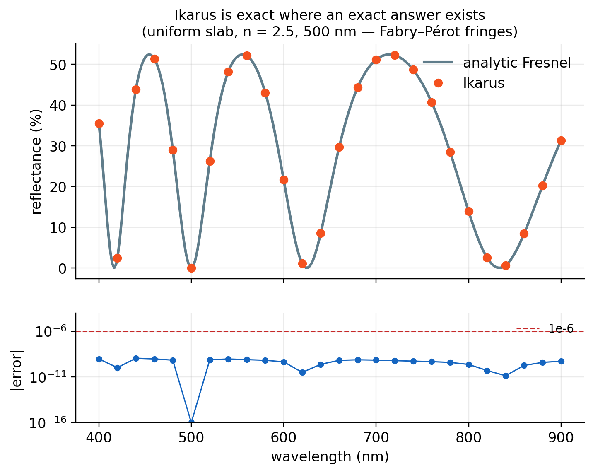
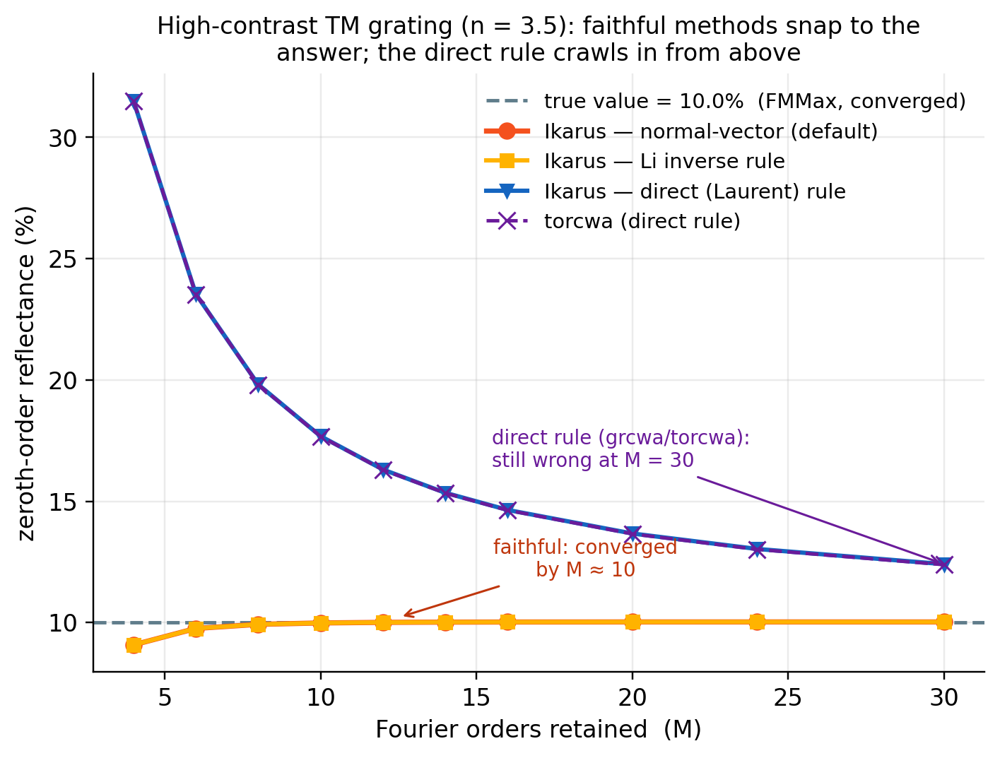
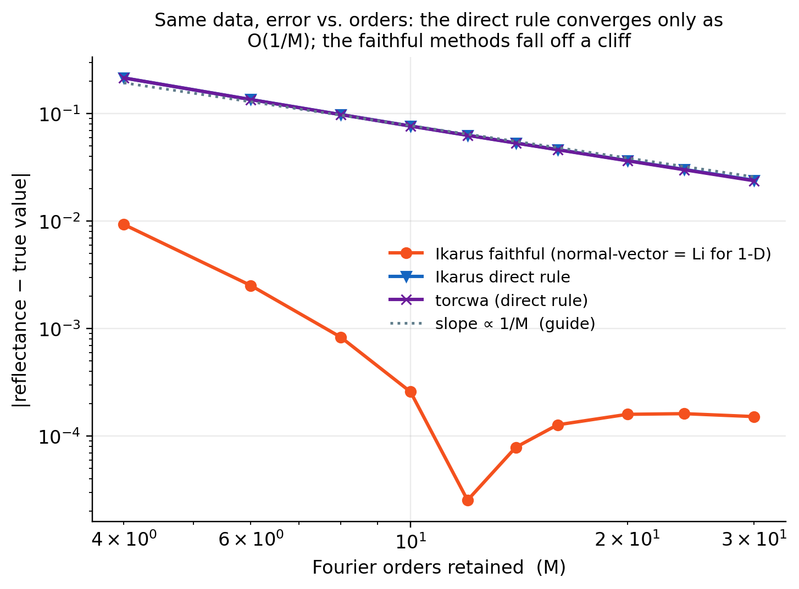
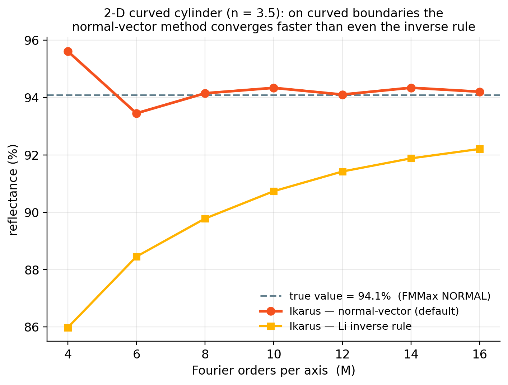
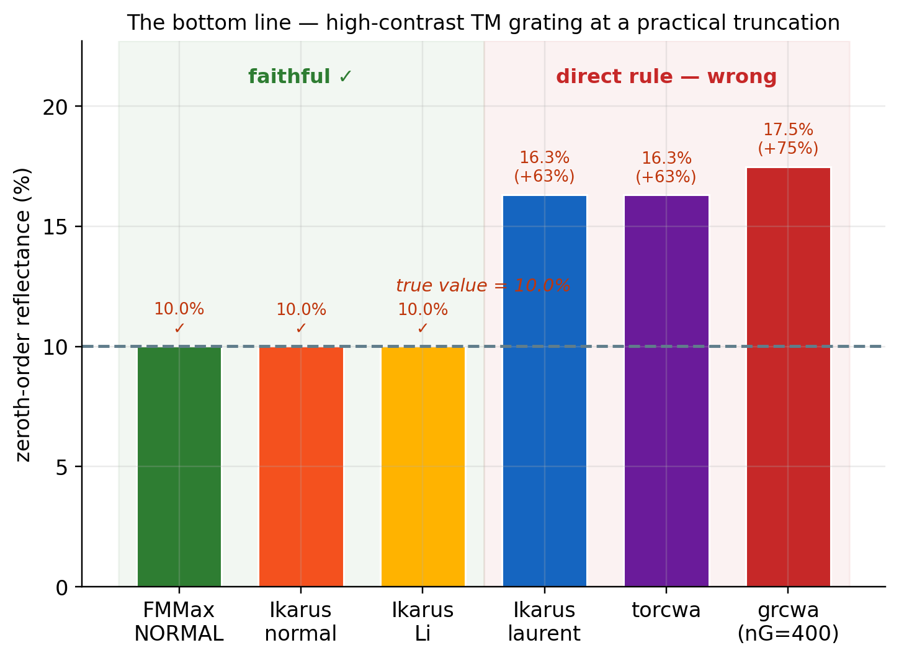

# Validation & Accuracy

*Or: how do you know Ikarus is telling the truth?*

A solver is only as good as the answers you can trust. Ikarus is checked two ways,
and this page shows both — with the receipts:

1. **Against exact analytic solutions**, where a closed-form answer exists.
2. **Against independent, separately-implemented RCWA solvers** on the *hard* cases
   — and, just as importantly, we show where several **popular tools quietly give the
   wrong answer**.

Everything below is a committed, runnable test ([reproduce it yourself](#reproduce-it-yourself)),
and every "true value" is an *independent* number, not ours.

## Exact where an exact answer exists

For a stack of **uniform** layers there is a closed-form answer — the Fresnel /
transfer-matrix solution. It is the easiest possible sanity check, and Ikarus
should nail it to machine precision. It does:

<figure markdown="span">
  { width="720" }
  <figcaption>A uniform slab has an exact answer; Ikarus reproduces its Fabry–Pérot
  fringes with an error of ~10⁻¹⁰ — ten thousand times tighter than the 10⁻⁶ line.
  Necessary, but the easy part.</figcaption>
</figure>

## The hard part: high index contrast

The interesting physics — and the interesting *failures* — live at sharp,
high-index-contrast boundaries: silicon, TiO₂ or GaP structures in air or on a
low-index substrate. Exactly the regime of modern metasurfaces.

Here RCWA hides a famous trap. To build its equations the method must Fourier-transform
products like *ε(x)·E(x)*. The naive approach — multiply the two Fourier series
directly (the **"direct" or Laurent rule**) — converges *painfully* slowly for **TM**
polarization across a high-index step. The fix (Li; Lalanne & Morris; Granet & Guizal,
all 1996) is to apply the **inverse rule** along the boundary normal. Ikarus does this
**by default** (its normal-vector / Fast-Fourier-Factorization method). Several widely
used open-source RCWA packages still use the direct rule — and it shows.

## Faithful vs. direct: the convergence test

The canonical stress test: a freestanding **n = 3.5** lamellar grating, TM
polarization. We sweep the number of Fourier orders `M` and watch the reflectance
converge. The dashed line is the true value — **from FMMax** (an independent solver)
at high truncation, not from Ikarus.

<figure markdown="span">
  { width="760" }
  <figcaption>Ikarus's faithful methods (orange/amber) snap to the true 10.0% by
  M ≈ 10. The direct rule — Ikarus's own <code>laurent</code> mode <em>and</em> torcwa,
  which sit exactly on top of each other — crawls in from above and is still
  <strong>25 % too high at M = 30</strong>.</figcaption>
</figure>

Plot the *error* instead, on log–log axes, and the two behaviours separate cleanly:

<figure markdown="span">
  { width="760" }
  <figcaption>The direct rule converges only as <strong>O(1/M)</strong> — it tracks the
  1/M guide line for as far as you care to compute. The faithful methods fall off a
  cliff and are essentially converged by M ≈ 12.</figcaption>
</figure>

!!! warning "Why this is dangerous, not just slow"
    Throughout that entire crawl, **energy is perfectly conserved** — `R + T = 1` to
    machine precision at every single `M`. A direct-rule tool therefore *looks*
    converged and self-consistent while being **60 % wrong**. Energy balance is not a
    convergence check (see [Core Concepts](core-concepts.md)); Ikarus judges
    convergence on the complex coefficients themselves, which is why it catches this.

## Curved boundaries (the 2-D case)

Real meta-atoms are round, not lamellar. On a **curved** boundary the normal-vector
method pulls ahead of *even* Li's separable inverse rule — this is the whole reason
it exists. On a high-contrast cylinder, Ikarus's default matches FMMax's independent
`NORMAL` implementation to **2.5 × 10⁻³** and is converged by M ≈ 8, while the plain
inverse rule is still climbing:

<figure markdown="span">
  { width="760" }
  <figcaption>Two independent implementations of the normal-vector method (Ikarus and
  FMMax) agree to ~0.25 % on a curved high-contrast cylinder; the separable inverse
  rule needs far more orders to catch up.</figcaption>
</figure>

## The bottom line

At a truncation a user would *actually* pick, here is what each solver reports for
that n = 3.5 TM grating:

<figure markdown="span">
  { width="760" }
  <figcaption>Faithful solvers land on the truth. Direct-rule tools miss by 60–75 %
  — at an order count where they look perfectly converged.</figcaption>
</figure>

| Solver | Factorization rule | Reflectance | Error vs. truth |
|---|---|---|---|
| **FMMax** (`NORMAL`) | faithful (FFF) | 10.0 % | *reference* |
| **Ikarus** (default) | faithful (normal-vector) | **10.0 %** | **< 0.3 %** |
| **Ikarus** (`li`) | faithful (inverse rule) | **10.0 %** | **< 0.3 %** |
| Ikarus (`laurent`) | direct (Laurent) | 16.3 % | +63 % |
| torcwa | direct (Laurent) | 16.3 % | +63 % |
| grcwa (nG = 400) | direct (Laurent) | 17.5 % | +75 % |

!!! tip "Ikarus is a *superset*, so switching costs nothing"
    Notice that Ikarus's own `laurent` mode reproduces torcwa **to ~2 × 10⁻⁴** — same
    rule, same numbers. Ikarus can do *exactly* what the direct-rule tools do, and it
    adds the faithful mode they lack. Moving to Ikarus loses nothing and gains
    correctness on the cases that matter.

## Reproduce it yourself

None of this is a static claim — it is a live test suite:

```bash
pip install "ikarus-rcwa[all]" fmmax grcwa torcwa
pytest ikarus/tests/validation/test_crosscode.py -v
python scripts/gen_validation_figures.py     # regenerates every figure above
```

The cross-check solvers (`fmmax`, `grcwa`, `torcwa`) are **optional** — they are not
Ikarus dependencies, so the tests skip automatically when they are absent. Each
reference harness is itself validated against analytic Fresnel to < 10⁻⁶ *before* it
is trusted on a grating, so the agreements above are genuine cross-code results, not
coincidences of convention.

## What this means for you

If your work involves **high-index-contrast** structures — silicon, TiO₂, GaP, GaN
meta-atoms in air or on a low-index substrate — Fourier factorization is not a
footnote. It is the difference between a design that behaves as simulated and one
that quietly doesn't. Ikarus defaults to the faithful method, tells you honestly when
you are not yet converged, and — as shown above — agrees with the most trusted
independent solver on exactly the cases where the convenient tools fail.

*Working on something in this regime? That is precisely the kind of problem
[we build for](citation.md) — reach out.*
